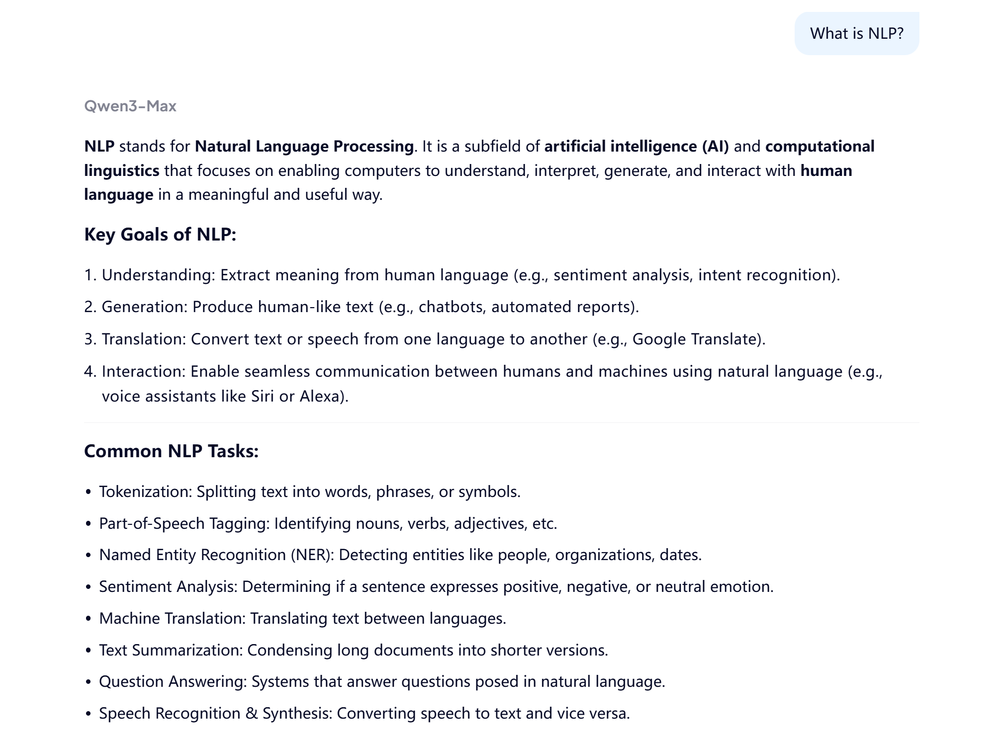
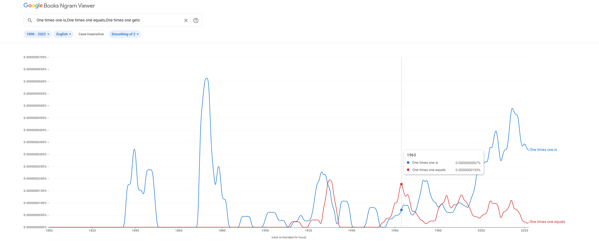
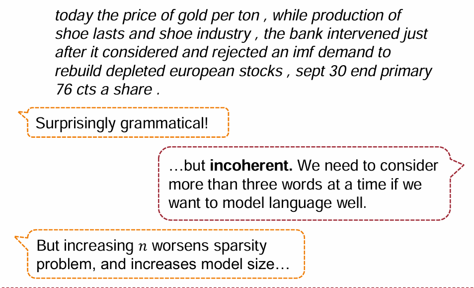
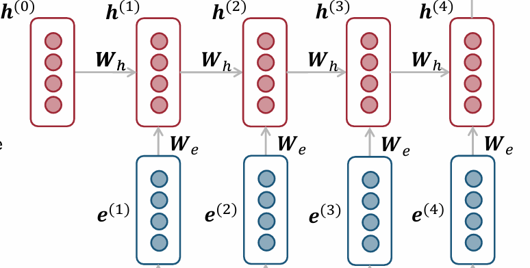
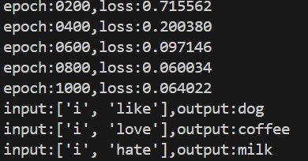
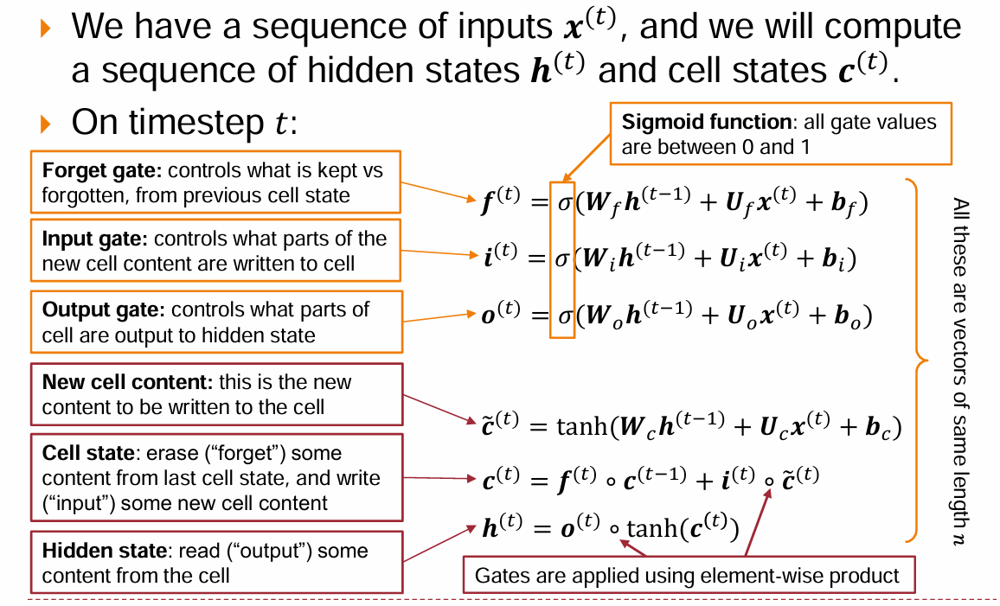
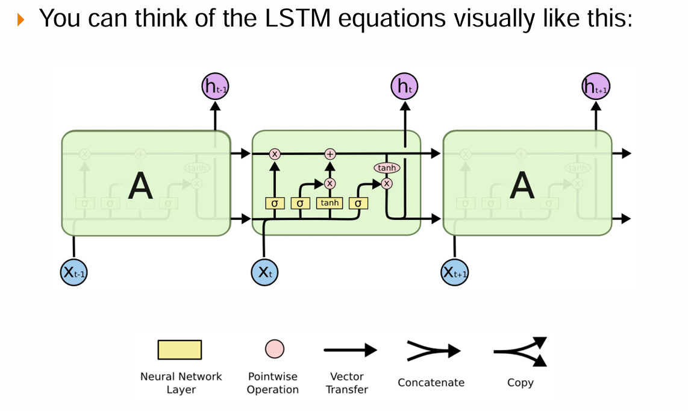
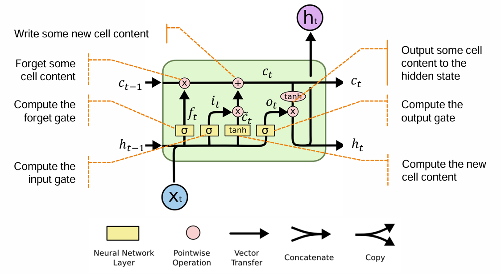

# CS190C Lec1

Word Embedding & Language Modeling

---

## Overview

* How to embed words
* What is language modeling
* Some naive and early language models
  * N-grams
  * RNN
  * LSTM

---

## PART1：How to embed words?

---

Problem: Computer cannot understand natural language...
* We should try to convert them, such as words, into digital form.
* How to represent words formally?

---

## A naive idea

* Like a dictionary, each word has its position in it
* Can we represent a word using a certain number?
  * That is: each word has its "one-to-one mapping value"
* Just like this:

<p align="center">

| **Word**  | I   | love | Natural | Language | Processing | " " | .   |
| --------- | --- | ---- | ------- | -------- | ---------- | --- | --- |
| **Value** | 0   | 1    | 2       | 3        | 4          | 5   | 6   |

</p>

`"I love Natural Language Processing."` $\Rightarrow$ `0,5,1,5,2,5,3,5,4,6`

---

## Mapping has its defect

* Can we have a method to infer this word's part of speech or meaning, just based on the mapping value?
* For example: If you only receive a string of numbers:`0,5,1,5,2,5,3,5,4,6`, can you successfully infer the meaning of this sentence?
* Mathematically, one-to-one mapping can be understood as: **The semantics of different words constitute a one-dimensional vector space!**
  * Each word is a 1-dim vector in this 1-dim space
  * Using 1-dim vector space to represent natural language is obviously not enough!

---

## Enlarge the dimension?

* If we use 2-dim space to represent some words?
  * x-aixs represent "area", y-axis represent "population"
  * Can we use 2-dim vectors to approximatly represent:`China` `India` `Canada` `Luxembourg`? (Plot a graph of it)
* Similarly, the higher the dimension, the richer the semantics it can represent.
* For example, GPT-3 uses 2048-dim to represent words.

---

## What is word embedding?

So far, we know that:

* We can use $n$-dim vector to represent the meaning of the word formally.
* Each dimension can be understood as a semantic feature, much like a spatial dimension in linear algebra.

We call these word vectors **Word Embedding**.

* Encoding words with appropriate word embeddings is a key concept in natural language processing.
* In later lectures, we will introduce some important encoder models. 

---

## PART2: What is language modeling?

---

## Look at an LLM

<div style="display: flex; gap: 20px;">

<div style="flex: 1;">



</div>

<div style="flex: 1;">

* Input a "prompt" (a string of words).
* Give an answer based on the prompt.

How does it generate words to finally form an answer?

* Similar to how humans speak, each word is generated logically based on the previous words.
* That is: based on past words, and generate new words.
* This is called **Language Modeling**!

</div>

</div>

---

### Tips: Difference between `Language Model` and `Language Modeling`

* Language Model: a tool to generate certain answer based on prompts.
* Language Modeling: the methods to generate "new words" based on "old words".

So, what's the **"methods"**?

---

## General methods

There might be several suitable options for the new generated word...

* But different word may have different levels of suitability.
* We can try to model "levels of suitability" into probabilistic distribution.
* That is, to find a way to calculate the probability of generating a certain word as the "next word," given the "previous words."

---

## Language Modeling Methods...

There are different models, using different certain methods to calculate the probabilistic distribution.
* N-grams
* RNN, LSTM (An optimized architecture based on RNN)
* Transformer
* GPT, BERT .etc (Based on Transformer)

---

## PART3： N-grams

---

## Another naive idea

Simply consider: 
* If we just focus on a fix window of previous words to generate a new word, it can still work at most of time.

For example:

* Look at only the 3 previous words to generate the next word.
* We call this a `4-grams`, meaning our fixed window (3 previous words + 1 predicted word) has a total length of 4 words.
* Prompt: "Let's calculate simple multiplication! One times one..."
* Previous words focused: `One times one`

---

## A naive 4-grams

* Previous words focused: `One times one`
* Generate new word directly use statistical laws!
* We can use https://books.google.com/ngrams/


---

## A naive 4-grams

<div style="display: flex; gap: 10px;">

<div style="flex: 1;">


* Try all words in vocabulary
* We can also get $P(\text{new}, \text{old})$ (marginal probability of 4-grams)
* What we want to model is $P(\text{new} \mid \text{old}) \propto P(\text{new}, \text{old})$

</div>

<div style="flex: 1;">

* Suppose we've modeled $P(w_i \mid \text{old})$.
* We choose $\arg\max_{w_i} P(w_i \mid \text{old})$ or sample words according to the distribution.
<br>
* Suppose we decide `is` to be the new word.
* Sentence now: `One times one is`
* Next turn: use `times one is` to generate a new word, and so on.

</div>

</div>

---

## Pros and cons?

* Quite simple, and requires very little calculation (especially on training)
* If we actually use N-grams for text generation, what will happen?

---

## Generate text?

<div style="display: flex; gap: 10px;">

<div style="flex: 1;">



</div>

<div style="flex: 1;">

* For **grammar**...
  * Local part-of-speech collocations (e.g., subject-predicate, verb-object) follow statistical rules successfully.
* But for **semantics**...
  * Missing of global context.
  * One mistake will cause an accumulation of subsequent errors.

</div>

</div>

---

## PART4: Recurrent Nerual Network (RNN)

---

## How to make use of global context?

**By Encoding**: 
* We've already encoded words as vectors.
* Can we encode entire sentences or texts as vectors too?
* If we get an encoded vector of text, we can generate new words with an "understanding" of the text!
<p align="center">
  
</p>

---

## How to encode words and text?

* For words:
  * At first, each word is still encoded with single number.
  * We aim to learn a matrix $W_e\in \mathbb{R}^{d \times |V|}$, where each column is the embedding of the $i$-th word.
  * Then for $i$-th word, we can get its embedding by computing $W_e e$, 
    * $e$ is the **one-hot vector** of this word (a vector of all zeros except for a $1$ at the $i$-th position)
  * $\Rightarrow$ Therefore, $W_e e$ perfectly extracts the $i$-th column of $W_e$

---

## How to encode words and text?

* For the text:
  * Similar to reading word by word, our understanding of the text becomes more substantial as we process each new word.
  * When a new word is read, the "understanding" of the text is a mixture of: the **previous understanding** of the text, and the **information** of the **new word**.
  * That is: the text embedding at the current time step should combine the **previous text embedding** and the **embedding of the new word**.

---

## How to encode words and text?

Let embedding of text in step-$t$ be $h^t$:

* Previous Context: $W_h h^{t-1}$. 
  * Learn $W_h$ to properly inherit previous information. 
* Current Input: $W_e e^t$
  * Learn $W_e$ to efficiently extract new word's information. 
* Combination: $W_h h^{t-1} + W_e e^t + b_1$. ($b_1$ is the optional bias term)
* Apply a nonlinear activation (usually use sigmoid)
  * Introduce non-linearity to model complex patterns.

---

## How to encode words and text?

<div style="display: flex; gap: 10px;">

<div style="flex: 1;">

* $h^t=\sigma(W_h h^{t-1} + W_e e^t + b_1)$
* Parameters to train:
  * $W_e$
  * $W_h$
  * $b_1$

</div>

<div style="flex: 1;">



</div>

</div>

---

## How to language modeling?

Just use a linear activation to $h^t$, generate the probability distribution of the new words!

<div style="display: flex; gap: 10px;">

<div style="flex: 1;">

* $\hat{y}^t=\text{Softmax} (Uh^t+b_2)$
* Parameters to train:
  * $U$: the linear activation matrix
  * $b_2$: the optional bias term

</div>

<div style="flex: 1;">


</div>

</div>

---

## Implement a simple RNN

https://github.com/kuangpenghao/NLP_models_by_hand/blob/main/toy_RNN.py


<div style="display: flex; gap: 20px;">

<div style="flex: 1;">

* 3 training sentences
* Train RNN
* Input sentence except the last word
* Hope to output the correct word

</div>

<div style="flex: 1;">



</div>

</div>

---

## Implement a simple RNN

* main function

```Python
if __name__=="__main__":

    config=TextRNNConfig()
    model=TextRNN(config)

    trainer=TextRNNTrainer(config,model)
    predictor=TextRNNPredictor(config,model)

    trainer.train()

    test_sentences=["i like dog", "i love coffee", "i hate milk"]
    for sentence in test_sentences:
        sentence=sentence.split()
        input_sentence=sentence[:-1]
        predicted_word=predictor.predict(input_sentence)
        print(f"input:{input_sentence},output:{predicted_word}")
```

---

## Implement a simple RNN

```Python
class TextRNNConfig:
    def __init__(self):
        self.n_hidden=5
        self.sentences=["i like dog", "i love coffee", "i hate milk"]

        word_list=' '.join(self.sentences).split()
        word_list=list(set(word_list))
        self.word_dict={w:i for i,w in enumerate(word_list)}
        self.number_dict={i:w for i,w in enumerate(word_list)}

        self.n_class=len(word_list)

        self.batch_size=2
        self.learning_rate=0.001
        self.epochs=1000
        self.interval=200
```

---

## Implement a simple RNN

```Python
class TextRNN(nn.Module):
    def __init__(self,config):
        super(TextRNN,self).__init__()
        self.config=config
        self.rnn=nn.RNN(self.config.n_class,self.config.n_hidden)
        self.W=nn.Linear(self.config.n_hidden,self.config.n_class,bias=True)

    def forward(self,X):
        X=X.transpose(0,1)
        ori_hidden=torch.zeros(1,X.shape[1],self.config.n_hidden)
        outputs,last_hidden=self.rnn(X,ori_hidden)
        output=outputs[-1]
        output=self.W(output)
        return output
```

---

## Implement a simple RNN

```Python
class TextRNNDataset(Dataset):
    def __init__(self,config):
        super(TextRNNDataset,self).__init__()
        self.config=config

    def __len__(self):
        return len(self.config.sentences)

    def __getitem__(self,idx):
        sentence=self.config.sentences[idx]
        words=sentence.split()
        words=[self.config.word_dict[i] for i in words]

        input_idx=words[:-1]
        one_hot=np.eye(self.config.n_class)[input_idx]
        input_one_hot=torch.tensor(one_hot,dtype=torch.float32)

        target_idx=words[-1]
        target_idx=torch.tensor(target_idx,dtype=torch.int64)

        return input_one_hot,target_idx
```

---

## Implement a simple RNN

```Python
class TextRNNTrainer:
    def __init__(self,config,model):
        self.config=config
        self.model=model
        self.loss_function=nn.CrossEntropyLoss()
        self.optimizer=torch.optim.SGD(model.parameters(),lr=self.config.learning_rate,momentum=0.9)

        self.datagetter=TextRNNDataset(config)
        self.dataloadder=DataLoader(self.datagetter,batch_size=self.config.batch_size,shuffle=True)

    def train(self):
        for epoch in range(self.config.epochs):
            for input_batch,target_batch in self.dataloadder:
                self.optimizer.zero_grad()
                output=self.model(input_batch)
                loss=self.loss_function(output,target_batch)
                loss.backward()
                self.optimizer.step()
            if (epoch+1)%self.config.interval==0:
                print(f"epoch:{epoch+1:04d},loss:{loss.item():.6f}")
```

---

## Implement a simple RNN

```Python
class TextRNNPredictor:
    def __init__(self,config,model):
        self.config=config
        self.model=model

    def predict(self,input_sentence):
        with torch.no_grad():
            word=[self.config.word_dict[i] for i in input_sentence]
            word=np.eye(self.config.n_class)[word]
            word=torch.tensor(word,dtype=torch.float32).unsqueeze(0)

            output=self.model(word)
            outcome=output.max(1,keepdim=False)[1]
            predicted_word=self.config.number_dict[outcome.item()]

            return predicted_word
```

---

## Pros and cons?

* Actually, it can make use of the information of the global text.

* When the text is extremely long, step $t$ is very large?
  * Gradient vanishing or exploding

---

## Update parameters ($W_h$)

<div style="display: flex; gap: 10px;">

<div style="flex: 1;">

$$
\begin{aligned}
\frac{\partial L_T}{\partial W_h} &= \sum_{t=1}^T\frac{\partial L_T}{\partial h^t}\frac{\partial h^t}{\partial W_h} \\
\frac{\partial L_T}{\partial h^t} &= \frac{\partial L_T}{\partial h^T}\frac{\partial h^T}{\partial h^{T-1}}...\frac{\partial h^{t+1}}{\partial h^t} \\
\frac{\partial h^{t+1}}{\partial h^t} &= \frac{\partial \sigma(W_hh^{t}+W_ee^{t+1}+b_1)}{\partial h^t} \\
    &= \sigma'(W_hh^{t}+W_ee^{t+1}+b_1) W_h
\end{aligned} 
$$

$$
\implies \frac{\partial L_T}{\partial h^t} = \frac{\partial L_T}{\partial h^T}\prod_{k=t+1}^T[\sigma'(z_k)W_h]
$$

</div>

<div style="flex: 1;">


</div>

</div>

* We usually use sigmoid function as $\sigma$. Then $\sigma'(z)=\sigma(z)(1-\sigma(z))$ $\in(0, 0.25]$

---

## Update parameters ($W_h$)

<div style="display: flex;">

<div style="flex: 1;">

* $\dfrac{\partial L_T}{\partial h^t}=\dfrac{\partial L_T}{\partial h^T}\displaystyle\prod_{k=t+1}^T[\sigma'(z_k)W_h]$
* If $\|W_h\|<1$, each term must $<1$ <br>$\Rightarrow \frac{\partial L_T}{\partial h^t} \to 0$, which may leads to $\frac{\partial L_T}{\partial W_h} \to 0$
  * **Vanishing gradient**
  * Causes inability to capture long-term dependencies.

</div>

<div style="flex: 0.6;">


</div>

</div>

* Likewise, if $\|W_h\|$ is large enough, $\frac{\partial L_T}{\partial W_h} \to \infty$
  * **Exploding gradient**
  * Causes bad updates and instability in training.

---

## PART5: Long Short-Term Memory (LSTM)

---

## Long Short-Term Memory RNNs (LSTMs)



---



---



---

## Think About It

* *N-gram models may not work well because of a lack of global context. Can we just make N very large to solve this problem?*

---

* **Sparsity**. You can easily find "gradient" in the corpus but hardly find a long phrase like "gradient may explode for RNN with large timesteps" 
* **State space**. You can estimate the massive scale based on the number of possible combinations.