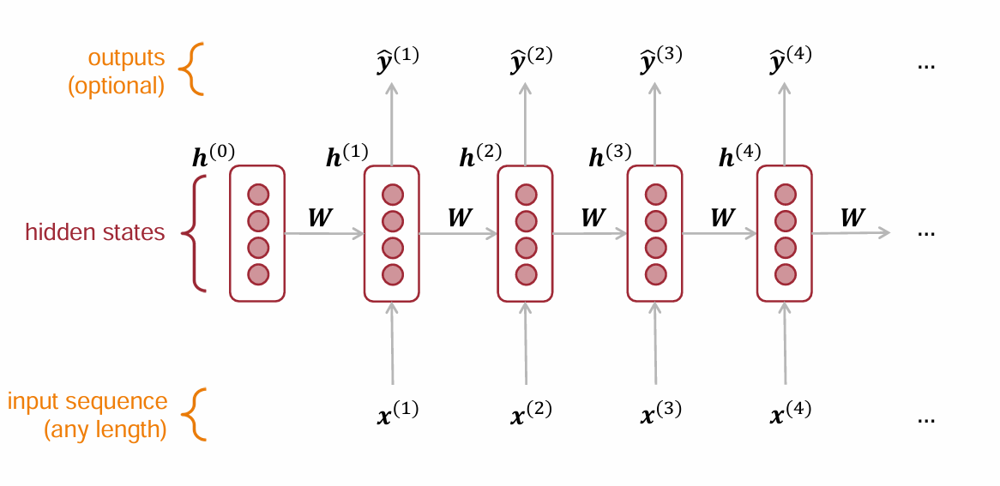
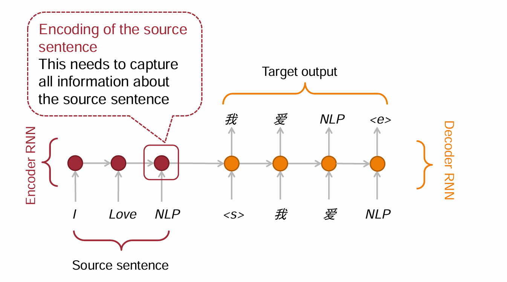
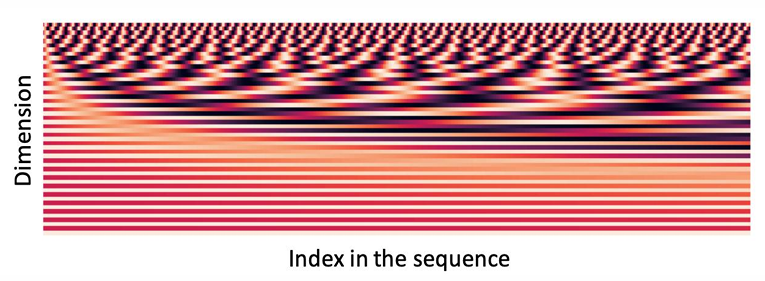
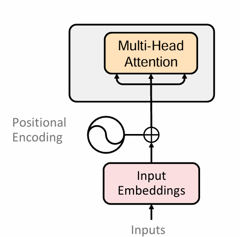
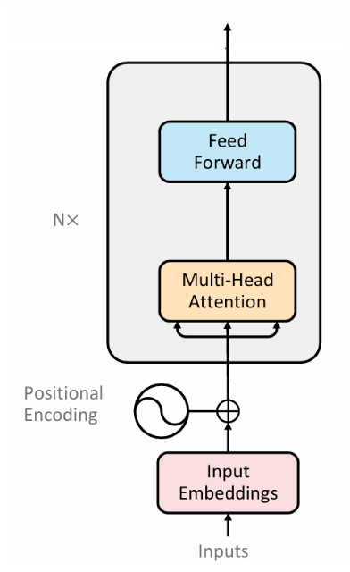
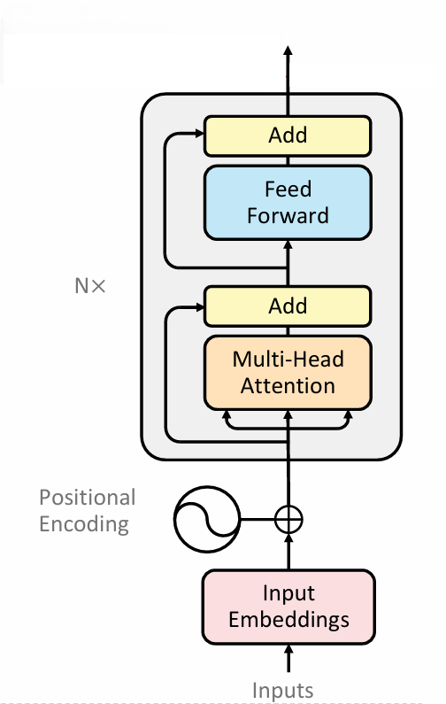
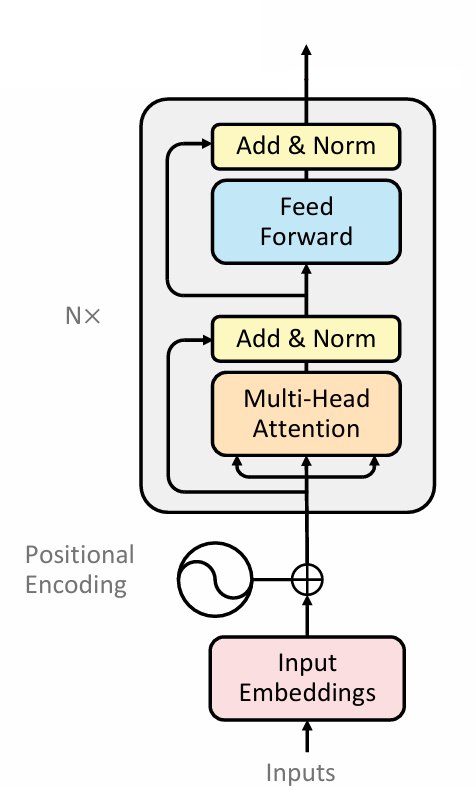
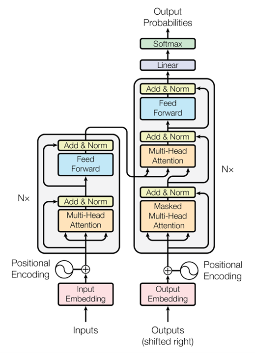
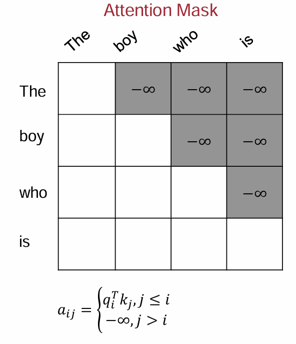

# CS190C Lec2
From Seq2Seq to Transformer

---

## Overview 
* What is Seq2Seq
* Seq2Seq with RNN
* Seq2Seq with Transformer
  * Attention
  * Position Embedding
  * Feed-Forward Network
  * Residual Connection
  * The Whole Transformer

---

## PART1: What is Seq2Seq

---

## Examples

* Given a Chinese sentence, translate to English $\Rightarrow$ Machine translation
* Given a long paragraph, conclude to a short sentence $\Rightarrow$ Abstract writing
* Given an academic report, convert to easy-to-understand article $\Rightarrow$ Style transfer

### Conclusion

**Seq2seq** (aka. Sequence to sequence) is a kind of language task to input a sequence and output a sequence according to certain demand.

---

## PART2: Seq2Seq with RNN

---

## RNN Review

`

* At each time step, the model receives and encodes a new word. 
* Combines this newly encoded word with the context of the previous text.
* With each time step, the representation (embedding) of the text is continually updated. 

`

* At the final time step, this embedding of text contains the complete information of the entire sequence.

---

## A Basic Approach

* The embedding of text contains the complete information of the entire sequence at last... 
* Input a sequence and use RNN (**Encoder**) to process it...
* The final embedding $h^T$ is expected to capture all the information from the text. 
* We can further generate the output based only on $h^T$.
* Use another RNN (**Decoder**) for generation, immediately following the first RNN.

---

## Seq2Seq with RNN

* **Encoder and Decoder** 

    

---

## Pros and Cons?

* Pros: Simple and intuitive.  
  
* Gradient problems from RNN.
* For long sequences, the model may not perform well —— not only gradient problems...
  * Encode everything into a single vector without proper weights.
  * In forward: ${\color{blue} h^t} = \sigma(W_h {\color{blue} h^{t-1}} + W_e e^t + b_1)$
  * Earlier information is repeatedly overwritten and diluted, even if it is important.
  * e.g. `The writer of the books _____(is/are)` 
    * $\Rightarrow$ `books` is closer and `writer` is farther.

---

## PART3: Seq2Seq with Transformer

[Attention Is All You Need](https://arxiv.org/abs/1706.03762) 

---

## PART3.1: Attention

---

## How to encode with proper weight?

`The writer of the books _____(is/are)` 

To fill the blank, we should find words whose properties strongly correlate with its "problems".

* **"Problems"**: How do we describe what a word is looking for?
* **"Properties"**: How do we describe the attributes of the word itself?
* **"Attention"**: If a word's "problem" and another word's "property" strongly match, it will cause significantly high weight.
* Once a match is found, how do we represent the actual information the target word provide?

---

## How to encode with proper weight?

* All above should rely on the word embeddings.
  * If a word has embedding $x \in \mathbb{R}^d$, each $x_i$ ($1\leq i \leq d$) indicates the magnitude of a specific semantic feature.

* The whole semantic of a word can be seen as conbination of all semantic features and their significance level. 
* Each semantic feature may represent certain kind of problems, properties and information. 

---

## How to encode with proper weight?

For all $d$ semantic features, we train three distinct weight matrices:

* Matrix $W^Q \in \mathbb{R}^{d \times d_{k}}$
  * Certain semantic feature causes a "problem", whose embedding $\in \mathbb{R}^{d_{k}}$.

* Matrix $W^K \in \mathbb{R}^{d \times d_{k}}$
  * Certain semantic feature will represent a "property", whose embedding $\in \mathbb{R}^{d_{k}}$.

* Matrix $W^V \in \mathbb{R}^{d \times d_{v}}$:
  * Certain semantic feature will feed back certain kind of information, whose embedding $\in \mathbb{R}^{d_{v}}$.

---

## How to encode with proper weight?

* How do we calculate the "problem" of a word? 
* Which is the combination of semantic features?

* Recall: Certain value of $x_i$ means the significance level of $i$-th semantic features.

$$
\begin{aligned}
W^Q &= [w^q_1, w^q_2, \dots w^q_d]^T \\
q &= x_1 w^q_1 + x_2 w^q_2 + \dots +x_d w^q_d
\end{aligned}
$$

* $\implies q=xW^Q$, which is the "problem" of a word.

* Similarly: $k=xW^K, v=xW^V$

* Embedding $x$ is projected into $q, k, v$.

---

## Scaling Dot-Product Attention (SDPA)

* For word $i$ with "problem" $q_i$, word $j$'s weight score with word $i$ is $q_ik_j^T$. 

* $\text{Softmax}$ function: Normalize the scores across all words and creates a probability distribution, as the weight for weighted sum $v_j$ fed back to word $i$.

* In matrix formula:
$$
\boxed{ ~ \text{Attention}_i=\text{Softmax}\left(\frac{QK^T}{\sqrt{d_{k}}}\right)V ~}
$$

* Tips: $\sqrt{d_{k}}$ is a scaling factor:  
  * As dimensions grow, dot products can get extremely large. 
  * Ensure the distribution not degenerate to one-hot. 
  * Pushing Softmax into regions with near-zero gradients in backward.

---

## Multihead Attention (MHA)

* Does a semantic feature have only one "problem", only one "property"?

* Repeat SDPA in $H$ channels, each channel stands for certain kind of "problem" and "property" pair. 
* So word $i$ has: $h_1$,$h_2$,...,$h_H$ ($h_j=\text{Attention}_i^j$).

$$\text{Attention}_i=\text{Concat}(h_1,h_2,...,h_H)W^O$$

---

## PART3.2： Position Embeddings

---

## A Problem

* If two sentences have same word but in different orders,  they usually has different meanings.  
  * `I study LLM`, `LLM study I`

* But what about MHA?
  * Only word embeddings and their $q,k,v$ matters, do not include position.

$\implies$ We should add some "tag" for each word, representing their position in the sentence. Thus it will have an impact on MHA.

---

## Sinusoidal position encoding in Transformer 2017

We should bring a regular transformation to word embeddings $x$, but how?

* Actually the transformation should be a function of position.

But is that enough? 

* Certain semantic features might be sensitive to local word order, but some are not.
  * The transformation must also be a function of the embedding dimension.
* The mapping function must output a unique vector for every exact (position, dimension) pair to prevent any ambiguity.

---

## Sinusoidal position encoding in Transformer 2017

Let $p_i$ be the position embedding at position $i$ with dimension $d$.
$$
p_j = 
\begin{cases}
\sin(pos \cdot \omega_j), & \text{if } j \text{ is even} \\
\cos(pos \cdot \omega_{j-1}), & \text{if } j \text{ is odd}
\end{cases}
,~ \text{where } \omega_d=\frac{1}{10000^{j/d}}
$$

* $\text{Period} = \dfrac{2\pi}{\text{pos}}10000^{j/d}$

* For different position, there will be a different embedding function $\Rightarrow$ one-to-one mapped.
* For different dimension: the period will change significantly from $2\pi$ to $20000\pi$, standing for different sensitivity of different kind of semantics.

    

---

## Pros and cons?

* It may also represent some relative position difference in a way.

$$
\begin{aligned}
    \begin{bmatrix}
    \text{sin}((pos+k)\omega_j) \\
    \text{cos}((pos+k)\omega_j)
    \end{bmatrix} 
    &=
    \begin{bmatrix}
    \text{cos}(\omega_jk) & \text{sin}(\omega_jk)\\
    -\text{sin}(\omega_jk) & \text{cos}(\omega_jk)
    \end{bmatrix}

    \begin{bmatrix}
    \text{sin}(pos\cdot \omega_j) \\
    \text{cos}(pos\cdot \omega_j)
    \end{bmatrix} \\

    &=
    
    M_{k,j}\begin{bmatrix}
    \text{sin}(pos\cdot \omega_j) \\
    \text{cos}(pos\cdot \omega_j)
    \end{bmatrix} \\

    \implies p_{pos+k} = M_k\cdot p_{pos}, &\text{ where } M_k=\text{diag}(M_{k,1},M_{k,2},\dots,M_{k,d/2})
\end{aligned}
$$

* Actually, instead of absolute position, in natural language, difference in semantic caused by position is usually relative position.

---

## Pros and cons?

* But sinusoidal position encoding is still absolute position.

For calculation of $q_i$ and $k_j$:

$$
\begin{aligned}
q_i k_j^T &= (x_i+p_i)W_QW_K^T(x_j+p_j)^T \\
&= x_iW_QW_K^Tx_j^T+p_iW_QW_K^Tx_j^T+x_iW_QW_K^Tp_j^T+p_iW_QW_K^Tp_j^T
\end{aligned}
$$

* For $p_iW_QW_K^Tp_j^T$, if $W_QW_K^T$ does not satisfy the structure of $M_k$, it is related to absolute position.
* For $p_iW_QW_K^Tx_j^T$ and $x_iW_QW_K^Tp_j^T$, it is completely determined by absolute position.

---

## What is the disadvantage of absolute position?

* Difference in semantics usually doesn't depend on it.
  * But it is different for attention calculation given a pair of tokens with the **same relative position** and **different absolute position**. 
  * The model may unnecessarily memorize absolute positions.
* When the model encounters very long sentences in reasoning after training,
  * The model doesn't know how to process the new, unseen absolute positions because it wasn't trained on them.
  * The outcomes will worsen.

So most LLMs now use `RoPE` to embbed position, which is a relative position embedding method (In Lec3).

---

## The language model for encoding so far...

    

* Add position embeddings before enter the encoder block.
* Enter the encoder block, using Multi-Head Attention to enrich the word embeddings using the information of text.
* We can use multiple layers of blocks to enrich it multiple times.
 
* But there still exists some problems...

---

## Problems

* MHA consists mostly of linear combinations. It struggles to process complex, non-linear feature transformations.
* Moreover, output embeddings can only aggregate information in the context.

**Example**: `I twisted the door handle, and the door ______`

To answer `opened`, the model should learn:
* Common sense of physics: Twisting will make it "open" instead of "broken".
* Common sense of life: We use handle to open it instead of threshold.
* Other "common sences" outside the text and beyond MHA.

How can we fix it?

---

## PART3.3: Feed-Forward Network

---

## Up-Projection

Suppose there are a numerous latent "global features".
* e.g. "Is it a tool to open something?"
* The number of features is larger than embedding dimensions.

How can we measure the relationship between the word embedding and this feature?
* Dot product: $x k_i^T$ is the relationship of $x$ and feature $i$.
* Activation function $\sigma$: Introduce non-linear.
  * e.g. ReLU: $\text{ReLU}(x)=\text{max}(x,0)$

* **Up-Projection**: $x_{ff}=\sigma(x W_1)$ 
  * Represents "the relationship between word embedding and different features."

---

## Down-Projection

We must project the vector back to the model's original dimension.

* **Down-Projection**: $x_{output}=x_{ff} W_2$. 
  * Maps the high-dimensional patterns back into the embedding space.

* Full FFN:
$$
\boxed{ ~ x_{output}=\sigma(xW_1) \cdot W_2 ~}
$$
* Dimension of $x_{ff}$ is usually $4d$.

 

Further Reading: [Transformer Feed-Forward Layers Are Key-Value Memories](https://arxiv.org/abs/2012.14913) 

---

## The language model for encoding so far...

    

* **Self-Attention**: Captures contextual information from the text.
* **Feed-Forward Networks (FFN)**: Extracts global feature information.
* Repeat the above steps for $N$ layers to deepen representation.
* However, as $N$ increases, training becomes more difficult.
  * Hard to train beyond 20~30 layers for such a kind of model. 

How can we address this challenge?

---

## PART3.4: Residual Connection

---

## The Forward Pass Perspective: A large number of layers?

* Consider a very deep network with $N$ layers, we actually need several layers to be expressive enough.
* So it means: If $N$ is very large, some layers can act as an identity transformation to maintain the information.
* However, it is difficult for MHA and FFN to learn a perfect Identity matrix $I$.
* So large $N$ may leads to performance degradation on the contrary.

---

## The Forward Pass Perspective: A large number of layers?

Question: It is hard to train $I$ for a layer. Is it hard to train $0$ ?

$\Rightarrow$ With $l_2-\text{Norm}$ (weight decay), parameters naturally tend toward 0.

* So why don't we learn the parameter based on identity transformation $I$?
  * Only learn difference of information, not absolute information.

$$
\begin{gathered}
y_l=\text{Attn}_l(x_l) ~\Rightarrow~ y_l=\text{Attn}_l(x_l)+x_l \\ 
x_{l+1}=\text{FFN}_l(y_l) ~\Rightarrow~ x_{l+1}=\text{FFN}_l(y_l)+y_l
\end{gathered}
$$

It can significantly avoid the degradation caused by large $N$.

---

## The Backward Pass Perspective: Chain rule?

$$
\begin{aligned}
\frac{\partial L}{\partial x_l} &= \frac{\partial L}{\partial x_{l+1}} \cdot \frac{\partial x_{l+1}}{\partial y_l} \cdot \frac{\partial y_l}{\partial x_l} \\
&=\frac{\partial L}{\partial x_{l+1}}\cdot \text{Attn}'_l\cdot \text{FFN}'_l
\end{aligned}
$$

For large $N$, we multiply many terms to update parameters of bottom layers.
* Familiar? It is the same as RNN. 
* Vanishing gradient may happen when some terms are small, which leads to almost not learnable parameters of bottom layers. 

---

## The Backward Pass Perspective: Chain rule?

    

  

Adding residual connection: 

$$
\begin{aligned}
\frac{\partial L}{\partial x_l} &= \frac{\partial L}{\partial x_{l+1}}\frac{\partial x_{l+1}}{\partial y_l}\frac{\partial y_l}{\partial x_l} \\
&= \frac{\partial L}{\partial x_{l+1}}(I+\text{Attn}'_l)(I+\text{FFN}'_l)
\end{aligned}
$$

* Even if some terms has gradient approches to 0, the gradients to flow directly from the top to the bottom. 

---

## PART3.5: Layer Normalization

---

## Estimate the scale of activations

* For a certain activation tensor, we consider the values of its elements as a distribution.
* The mean of distributions is usually close to 0, but the variances are different. Therefore, we use variance to measure the overall magnitude of the activations. 
* In a residual network, how does the variance of these activations change across different layers?

---

## Estimate the scale of activations

* In preliminary stage of training, parameters are initialized randomly. 
  * Activation of each module $F$ is approximately independent of its input.

$$
\begin{aligned}
\text{Var}(x_2) &= \text{Var}(x_1+F(x_1))=\text{Var}(x_1)+\text{Var}(F(x_1))=(1+\alpha)\text{Var}(x_1) \\ 
\text{Var}(x_3) &= \text{Var}(x_2+F(x_2))=(1+\alpha)\text{Var}(x_2)=(1+\alpha)^2\text{Var}(x_1) \\ 
\text{Var}(x_n) &= (1+\alpha)^{n-1}\text{Var}(x_1) 
\end{aligned}
$$

* Exponential Explosion!

---

## Layer norm

    

 

We should perform a normalization to activations in each module. That is:

$$\hat{x}=\frac{x-\mu}{\sigma}$$

It can reduce the explosion of activations.

In next lecture, we will discuss where to perform (post-norm & pre-norm), how to perform(LN & RMSNorm)

---

## PART3.6: The Whole Transformer

---

    

### Seq2Seq with Transformer

* Encoder
  * Use $N$ layers to encode the input embeddings, the output of $N$-th layer is the encode outcomes.
* Decoder
  * Self-attention modules: absorb the decoded information.
  * Cross-attention modules: absorb the information of encoder.
* Linear
  * Projects decoder from embedding to distributions over vocabulary words.

---

## What is Masked MHA?

    

For $QK^T$ matrix:

* We apply an upper triangular mask to it, setting the upper-right elements equals to $-\infty$.
* When we apply $\text{Softmax}$ to it, the upper part elements receive weight 0.
* It means: When $i$-th word aggregates information in the context, $j$-th word should contribute no information if $j>i$.

---

# Why Masked MHA?

* What does the training data look like?
  * $\Rightarrow$`inputs`+`outputs`

* Masking enforces the **auto-regressive property** during training.
  * During training process, the model decoder tries to output a sequence of embeddings, that is the decoded "sentence".
  * At the $i$-th position, the model uses the encoder output and the previously generated words (positions from 1 to $i$) to predict the $(i+1)$-th word.
  * Therefore, the mask can effectively prevents **information leakage**, forcing the model to actually learn next-token prediction.