---

marp: true
theme: default
paginate: true
math: katex
style: |
    section {
        background: linear-gradient(
            to bottom,
            #a9deff 0%,
            #ffffff 15%,
            #fdfdfd 95%,
            #acd3ff 100%
        ) !important;
        color: #0c0000;
    }

---

# CS190C Lec3
Evolution of the Transformer

---

## Overview

* Architecture
* Attention
  * KV Cache
  * RoPE
  * Sliding window/Sparse attention
* FFN
  * SwiGLU
  * MoE
* Normalization
  * Normalization Position
  * Normalization Methods

---

## PART1: Architecture

---

## 1. Encoder model

<div style="display: flex; gap: 30px;">

<div style="flex: 0.4;">

<p align="center">
    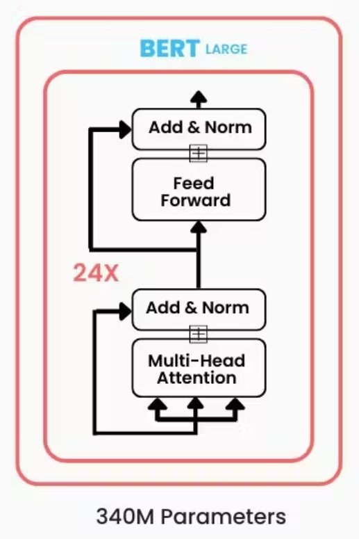
</p>

</div>

<div style="flex: 1;">

### [BERT: Pre-training of Deep Bidirectional Transformers for Language Understanding](https://arxiv.org/abs/1810.04805)
* Based on the encoder part of the original Transformer.

* **What it does**: 
  * Given a masked sentence.
    * `Andrew Ng [MASK] an ML researcher.` 
  * It can predict the embedding of all `[MASK]` tokens using bidirectional context.

</div>

</div>

---

## 1. Encoder model

<div style="display: flex; gap: 30px;">

<div style="flex: 0.4;">

<p align="center">
    
</p>

</div>

<div style="flex: 1;">

### [BERT: Pre-training of Deep Bidirectional Transformers for Language Understanding](https://arxiv.org/abs/1810.04805)

* **How it is trained**: **MLM** (Masked Language Model)
  * Predict a certain percentage of input tokens. These tokens are either replaced with `[MASK]`, a random token, or left unchanged.
  * Trained by comparing its predictions against the ground-truth original words.
* Good at natural language understanding tasks, but not designed for text generation.

</div>

</div>

---

## 2. Decoder model

<div style="display: flex; gap: 20px;">

<div style="flex: 1.3;">

<p align="center">
    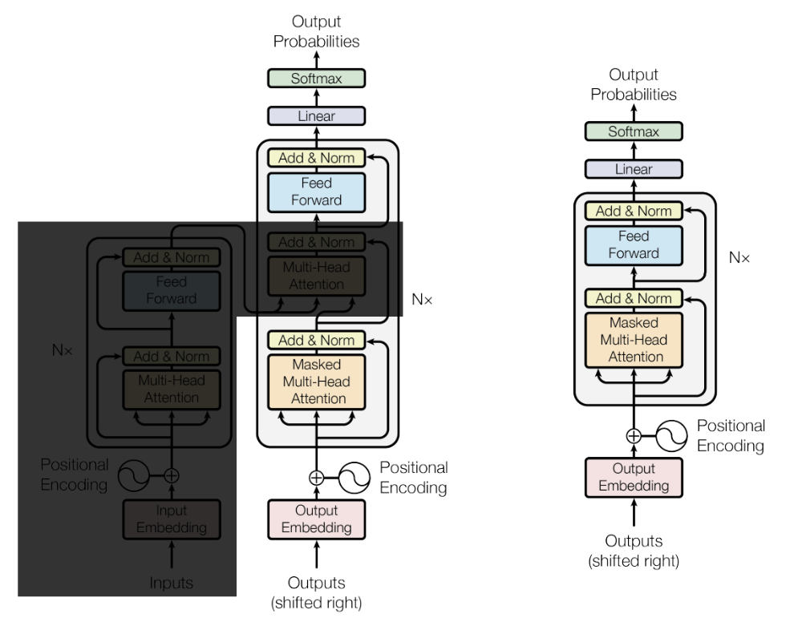
</p>

</div>

<div style="flex: 1;">

<br>

### GPT-3 
* In [Language Models are Few-Shot Learners](https://arxiv.org/abs/2005.14165)
* Remove encoder and cross-attention in original Transformer.

</div>

</div>

---

## 2. Decoder model

<div style="display: flex; gap: 10px;">

<div style="flex: 0.3;">

<p align="center">
    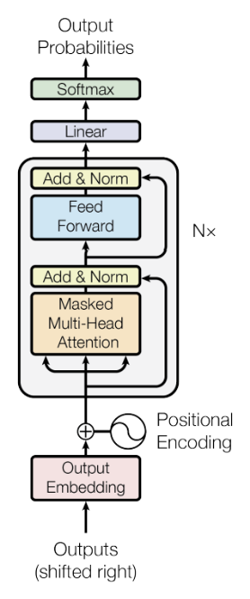
</p>

</div>

<div style="flex: 1;">

#### GPT-3
* **What it does**: Given an input, it auto-regressively decode: 
  * Predicts the next token based on the current sequence.
  * Iteratively appends the predicted token to the sequence.
* **How it is trained**: **CLM** (Causal Language Model)
  * Trained on continuous text to predict the next token.
  * Comparing its predicted next token against the ground-truth actual word in the text. *(More in Lec 6)*
* Excellent at text generation. But perform not as well as encoder models for understanding tasks.
  * Only unidirectional attention

</div>

</div>

---

## 3. Encoder-Decoder model

Based on the original Transformer design. 
* **T5**: [Exploring the Limits of Transfer Learning with a Unified Text-to-Text Transformer](https://arxiv.org/abs/1910.10683)

* Strong at natural language tasks, especially Seq2Seq tasks.
* However, currently it largely substituted by Decoder-only models.

<p align="center">
    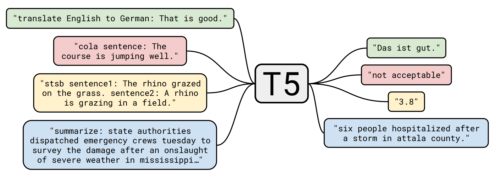
</p>

---

## 3. Encoder-Decoder model

* However, currently it largely substituted by Decoder-only models.
  * Trained by masking and reconstructing text spans. 
    * Differs from the standard "prompt + answer" format in inference. 
    * Relies heavily on downstream fine-tuning.
  * In inference, the encoder runs only once, while the decoder runs auto-regressively for many steps. 
    * Considerable part of parameters in the encoder are underutilized.
  * Requires maintaining separate KV caches for both decoder self-attention and encoder-decoder cross-attention. 
    * Increases architectural complexity and memory consumption.

---

## Summary on architecture

In this course, we will focus primarily on **Decoder-only models**, as they are currently the dominant architecture in modern LLMs.

<p align="center">
    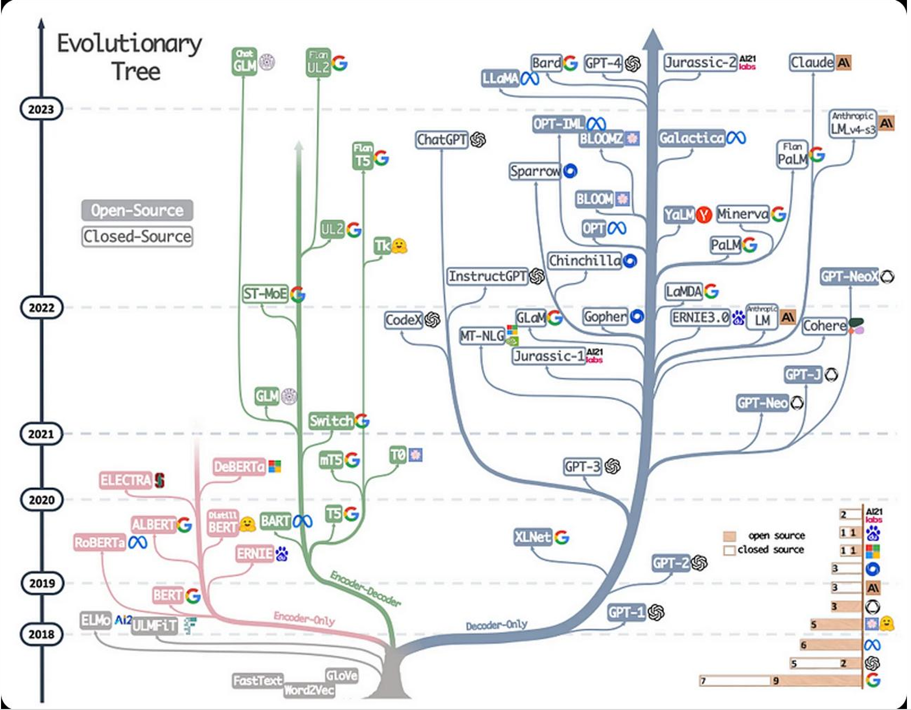
</p>

---

## PART2: Attention

---

## PART2.1: RoPE

[RoFormer: Enhanced Transformer with Rotary Position Embedding](https://arxiv.org/abs/2104.09864)

---

## Position embedding

* **Original Transformer:** **Sinusoidal positional encoding**.
* **Limitations (Review from Lec 2):** 
  * Absolute position indices.
  * Struggles in inference for sequences longer than those seen during training.
* **The Modern LLM:** **RoPE (Rotary Position Embedding)**.

---

## RoPE: Rotary Position Embedding

Apply the rotation: $\bm{x} \mapsto \bm{R}^i\bm{x}$.
* Given an embedding $\bm{x} \in \mathbb{R}^d$ (where $d$ is even) at position $i$:
* Divide the $d$-dimensional vector into $d/2$ pairs (2D sub-spaces).
* Rotate each pair by an angle $\theta_{i,k}$.
$$
\bm{R}^i =
\begin{bmatrix}
\bm{R}^i_1 & 0 & 0 & \cdots & 0 \\
0 & \bm{R}^i_2 & 0 & \cdots & 0 \\
0 & 0 & \bm{R}^i_3 & \cdots & 0 \\
\vdots & \vdots & \vdots & \ddots & \vdots \\
0 & 0 & 0 & \cdots & \bm{R}^i_{d/2}
\end{bmatrix},
\quad \text{where}
\begin{cases}
\bm{R}^i_k =
\begin{bmatrix}
\cos(\theta_{i,k}) & -\sin(\theta_{i,k}) \\
\sin(\theta_{i,k}) & \cos(\theta_{i,k})
\end{bmatrix}, \\
\theta_{i,k} = \dfrac{i}{\Theta^{2k/d}} .
\end{cases}
$$

---

## RoPE: Rotary Position Embedding

$$
\bm{R}^i =
\mathrm{diag}\left(\bm{R}^i_1, \bm{R}^i_2, \dots, \bm{R}^i_{d/2} \right),
\text{where }
\bm{R}^i_k =
\begin{bmatrix}
\cos(\theta_{i,k}) & -\sin(\theta_{i,k}) \\
\sin(\theta_{i,k}) & \cos(\theta_{i,k})
\end{bmatrix},
$$

<div style="display: flex; gap: 10px;"> 

<div style="flex: 1;">

The attention score with RoPE depends only on relative position.

* Property of rotation matrix $\bm{R}$: $\bm{R}^m(\bm{R}^n)^T = \bm{R}^{m-n}$
  * Transpose = inverse, Multiplication → Addition of powers. 

* In the attention mechanism, given a query $\bm{q}_i$ at position $i$ and a key $\bm{k}_j$ at position $j$:
  $$\bm{q}'_i = \bm{R}^i\bm{q}_i, \quad \bm{k}'_j = \bm{R}^j\bm{k}_j$$
  $$(\bm{q}'_i)^T \bm{k}'_j = \bm{q}_i^T (\bm{R}^i)^T \bm{R}^j \bm{k}_j = \bm{q}_i^T \bm{R}^{j-i} \bm{k}_j$$

</div>

<div style="flex: 0.3;">

<div style="display: flex; align-items: center; height: 100%;">
    <p align="center" style="width: 100%;">
        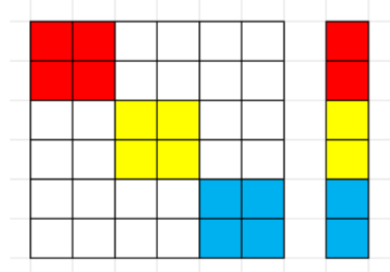
    </p>
</div>

</div>

</div>

---

## How to understand it?

$$(\bm{q}'_i)^T \bm{k}'_j = \bm{q}_i^T (\bm{R}^i)^T \bm{R}^j \bm{k}_j = \bm{q}_i^T \bm{R}^{j-i} \bm{k}_j$$

* Rotating $\bm{q}$ and $\bm{k}$ by their absolute positions translates into a purely relative rotation ( $\bm{R}^{j-i}$ ) in the dot product.
  * Review: Sinusoidal method leave residual absolute position terms.
* Only change the direction of the vectors, not their length.
  * Attention logits: $\bm{q}^T\bm{k}=\|\bm{q}\|\|\bm{k}\|\cos(\Delta\theta)$
  * If we use sinusoidal embeddings, the addition alters the length of vectors. 
    * This introduces uncontrollable distortion into the attention logits.
  * But in RoPE, for any two specific vectors, the attention logit depends strictly on their relative distance!

---

## How to understand it?

<p align="center">
    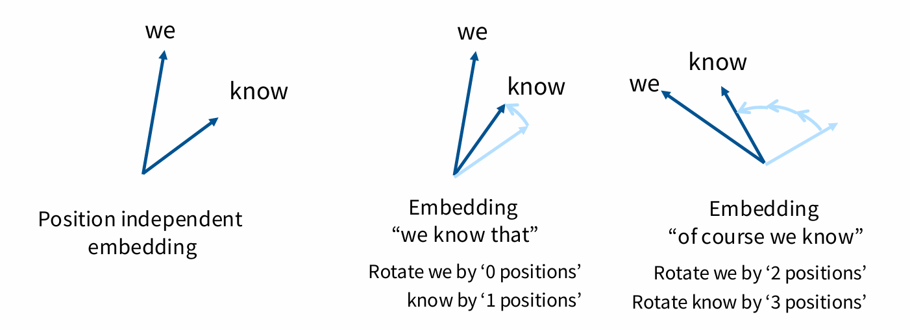
</p>

---

## Part2.2: KV-Cache

---

## Autoregressive decode task

Consider generating a sentence: `There are three...`

What should we calculate in attention?

* $q$ vector for the current position.
* $k, v$ vectors for all previous tokens: `There` `are` `three`.

Suppose we generate `kinds`. What should we calculate in attention next turn?

* $q$ vector for the new position.
* $k, v$ vectors for all previous tokens: `There` `are` `three` `kinds`.

Observation: We re-calculate $k$,$v$ vectors of `There` `are` `three` at each step.  
* Can we cache them to avoid redundant computation?

---

## KV-Cache

* **KV-Cache**: Cache the $k$ and $v$ vectors of all previous tokens to avoid redundant computation.
  * Reduces the total computational complexity from $\Theta(N^2)$ to $\Theta(N)$.

* **Bottleneck:** Caching all history vectors consumes a significant amount of memory.

* Performance-Memory Trade-off:
  * Several methods: MQA, GQA, MLA and so on.

---

## MQA

<div style="display: flex; gap: 10px;">

<div style="flex: 0.5;">

<p align="center">
    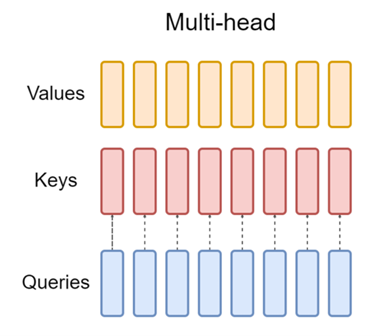
    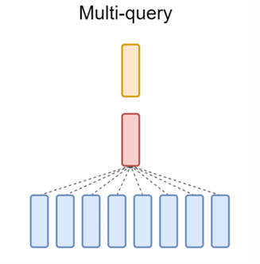
</p>

</div>

<div style="flex: 1;">

**MQA (Multi-Query Attention)**: 

* Baseline: Vanilla MHA.
* Mechanism: All query heads share a single pair of Key and Value heads.

Pros and cons:

* Greatly saves memory space.
* Distinct query heads are forced to share the same representation subspace, leading to performance degradation.

</div>

</div>

---

## GQA

<div style="display: flex; gap: 10px;">

<div style="flex: 0.5;">

<p align="center">
    
    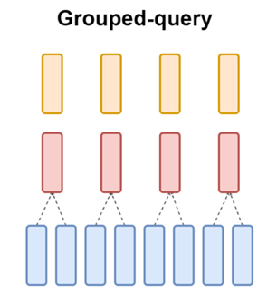
</p>

</div>

<div style="flex: 1;">

<br>

**GQA (Grouped-Query Attention)**: 

* Baseline: Vanilla MHA.
* Mechanism: Divides query heads into $G$ groups. Each group shares a single pair of Key and Value heads.

<br>

* Make a balance between the high quality of MHA and the memory efficiency of MQA.
* Widely adopted by modern LLMs (e.g., LLaMA, Gemma).

</div>

</div>

---

## A new idea

* Avoid directly store vectors: the combined $k$ and $v$ across all heads are typically not full-rank.
* Instead of storing full KV heads, we compress them into a compact Latent Vector.
  * Store this small latent vector in the cache.
  * Reconstruct the full vector during the attention calculation.
* This is **Multi-Head Latent Attention (MLA)**.
  * Proposed in [DeepSeek-V2: A Strong, Economical, and Efficient Mixture-of-Experts Language Model](https://arxiv.org/abs/2405.04434)

---

## MLA

<div style="display: flex; gap: 10px;">

<div style="flex: 0.5;">

<p align="center">
    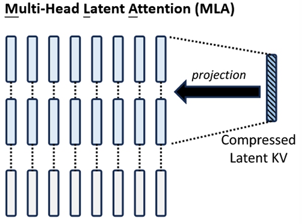
</p>

</div>

<div style="flex: 1;">

**Compression for KV**

* Compression: $\mathbf{c}_t^{KV}=W^{DKV}\mathbf{h}_t$. 
  * Compresses $\mathbb{R}^{d_{\text{model}}}$ to $\mathbb{R}^{d_c}$.
* Reconstruction of $k, v$:
$$
\mathbf{k}_{t}^C=W^{UK}\mathbf{c}_t^{KV};\quad \mathbf{v}_{t}^C=W^{UV}\mathbf{c}_t^{KV}
$$

* Only cache $\mathbf{c}_t^{KV}$ instead of $\mathbf{k}_{t}, \mathbf{v}_{t}$.

</div>

</div>

**Compression for Q**
* Compression and Reconstruction: $\mathbf{c}_t^Q = W^{DQ}\mathbf{h}_t;~ \mathbf{q}_t^C = W^{Q}\mathbf{h}_t = W^{UQ}\mathbf{c}_t^Q$

* Reduces the activation memory during training.

---

## MLA

<div style="display: flex; gap: 10px;">

<div style="flex: 0.5;">

<p align="center">
    
</p>

</div>

<div style="flex: 1;">

**Reduction of Redundant Computation**

$$
\begin{aligned}
\mathbf{q}_{t}^T\mathbf{k}_{j}
&= \left( W^{Q}\mathbf{h}_t \right)^T \left( W^{UK}\mathbf{c}_j^{KV} \right) \\
&= \left[ \mathbf{h}_t^T {\color{blue} (W^{Q})^T W^{UK}} \right] \mathbf{c}_j^{KV}
\end{aligned}
$$

* We can absorb $W^{UK}$ into $W^{Q}$. 
  * No re-computation of $\mathbf{k}$ in each step.
  * Maintain the complexity of $\Theta(N)$.

</div>

</div>

* Similarly for $\mathbf{v}$, we can absorb $W^{UV}$ into $W^{O}$. 
$$
\begin{aligned}
\mathbf{o}_{t,i} &= \sum\mathrm{Weights}_{t,j} \mathbf{v}_{j,i}^C = W^{UV}_i \sum\mathrm{Weights}_{t,j} \mathbf{c}_{j,i}^{KV}\\
\mathbf{u}_t &= W^O [\mathbf{o}_{t,1};\mathbf{o}_{t,2};\dots;\mathbf{o}_{t,n_h} ], 
\end{aligned}
$$

---

## MLA

<div style="display: flex; gap: 10px;">

<div style="flex: 1;">

However, **the compression complicates RoPE**: 

$$
\begin{aligned}
&\quad \mathrm{RoPE}(\mathbf{q}_{t})^T \mathrm{RoPE}(\mathbf{k}_{j}) \\
&= \mathbf{q}_{t}^T \mathbf{R}^{t-j} \mathbf{k}_{j} \\
&= ( W^{Q}\mathbf{h}_t )^T \mathbf{R}^{t-j} \left( W^{UK}\mathbf{c}_j^{KV} \right) \\
&= \left[\mathbf{h}_t^T {\color{blue} (W^{Q})^T} {\color{red} \mathbf{R}^{t-j}} {\color{blue} W^{UK}} \right] \mathbf{c}_j^{KV}
\end{aligned}
$$

* Because of the rotation matrix $\mathbf{R}^{t-j}$, $W^{UK}$ can not be absorbed into $W^{Q}$. 
  * Forces the re-computation of full $\mathbf{k}$ at each step.

</div>

<div style="flex: 1;">

Instead, we use **Decoupled RoPE**. 
* We split $\mathbf{q},\mathbf{k}$ into **Compressed** $(C)$ and **Rotation** $(R)$ parts:
* For attention head $i$: 

$$
\begin{aligned}
[\mathbf{q}_{t,1}^C;\dots;\mathbf{q}_{t,n_h}^C] = \mathbf{q}_{t}^C &= W^{UQ}\mathbf{c}_t^Q  \\
[\mathbf{q}_{t,1}^R;\dots;\mathbf{q}_{t,n_h}^R] = \mathbf{q}_t^R &= \mathrm{RoPE}(W^{QR}\mathbf{c}_t^Q) \\
\mathbf{q}_{t,i} &= [\mathbf{q}_{t,i}^C ;\mathbf{q}_{t,i}^R] \\
[\mathbf{k}_{t,1}^C;\dots;\mathbf{k}_{t,n_h}^C] = \mathbf{k}_{t}^C &= W^{UK}\mathbf{c}_t^{KV} \\
\mathbf{k}_t^R &= \mathrm{RoPE}(W^{KR}\mathbf{h}_t) \\
\mathbf{k}_{t,i} &= [\mathbf{k}_{t,i}^C ;\mathbf{k}_t^R]
\end{aligned}
$$

</div>

</div>

---

## MLA

Now for new vectors $\mathbf{k}_{t,i} = [\mathbf{k}_{t,i}^C ;\mathbf{k}_t^R]$ and $\mathbf{q}_{t,i} = [\mathbf{q}_{t,i}^C ;\mathbf{q}_{t,i}^R]$: 

$$
\begin{aligned}
\mathbf{q}_{t,i}^T\mathbf{k}_{j,i} 
&= \underbrace{(\mathbf{q}_{t,i}^{C})^T\mathbf{k}_{j,i}^C}_{\text{Compressed}} + \underbrace{(\mathbf{q}_{t,i}^{R})^T\mathbf{k}_j^R}_{\text{Rotation}} \\ 
&= \left[ (\mathbf{c}_t^Q)^T ( W^{UQ}_i )^T W^{UK}_i \right] {\color{blue}\mathbf{c}_j^{KV}} + \mathrm{RoPE}(W^{QR}\mathbf{c}_t^Q)^T {\color{blue}\mathbf{k}_j^R }\\
\end{aligned}
$$

* By caching $\mathbf{c}_j^{KV}$ and $\mathbf{k}_j^R$, we avoid recomputation.

$$
(\mathbf{q}_{t,i}^{R})^T\mathbf{k}_j^R = (\mathbf{c}_t^Q)^T (W^{QR}_i)^T \cdot \mathbf{R}^{t-j} \cdot W^{KR}\mathbf{h}_j
$$

* By isolating RoPE entirely to the second term of the dot product, positional information is successfully injected without breaking the compression.

---

## Summary on Reducing KV Cache 

<p align="center">
    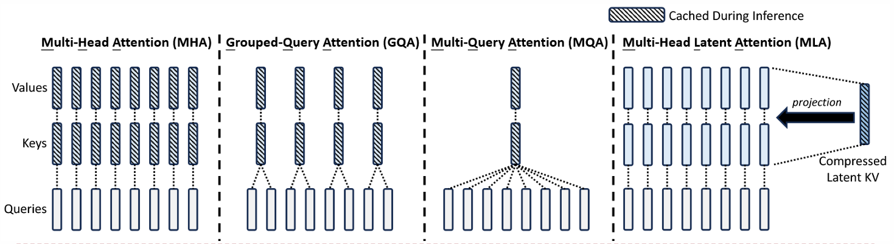
</p>


---

## PART2.3: Sparse Attention

---

## Efficient Attention Calculation

* Standard attention time complexity is $\Theta(N^2)$. The dominant computational cost is the $QK^T$ matrix multiplication.
* $\Rightarrow$ Optimize the calculation to achieve a balance between accuracy and efficiency.
* **Solution:** **Sparse Attention**
  * Instead of the full dense matrix, we only calculate attention logits for a specific subset of token pairs according to pre-defined patterns.

---

## Sliding window attention

* We only attend to the nearest $k$ tokens. 
  * This results in a **diagonal band** pattern in the attention matrix.

* Although each layer only sees a local window, stacking multiple layers of Transformer expands the effective context length.
* Information from previous tokens is propagated through intermediate tokens, allowing the model to indirectly capture long dependencies.

<p align="center">
    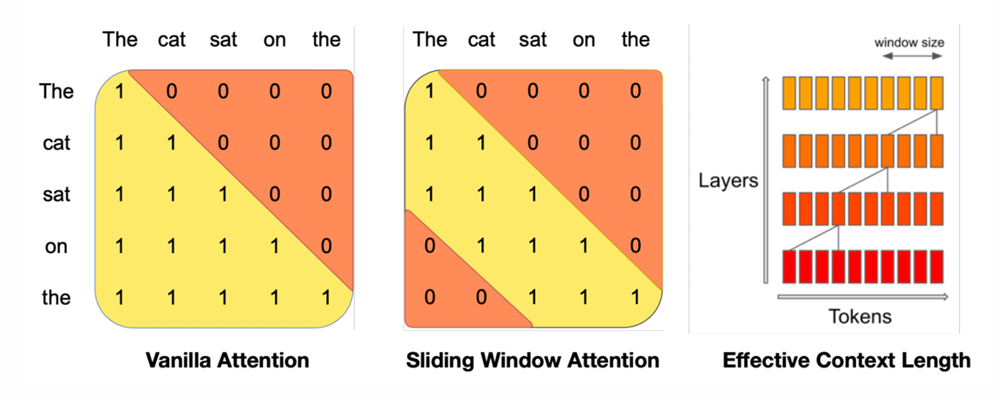
</p>

---

## Sparse Transformer

<div style="display: flex; gap: 10px;">

<div style="flex: 0.8;">

* From [Generating Long Sequences with Sparse Transformers](https://arxiv.org/abs/1904.10509)

<div style="display: flex; height: 100%;">
    <p align="center" style="width: 100%;">
        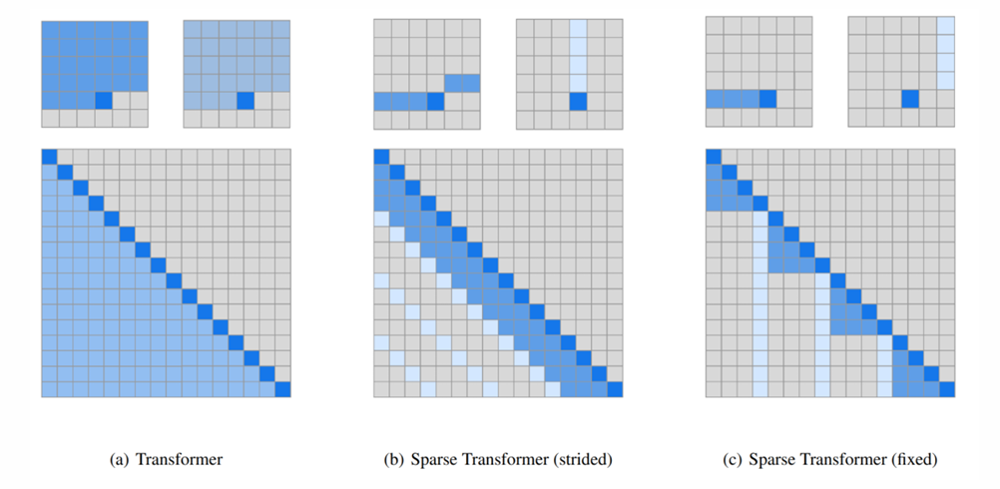
    </p>
</div>

</div>

<div style="flex: 1; font-size: 0.9em;">

* Sparse Transformer (strided)
  * Attends to recent tokens and periodic previous tokens.
    * Like "intensive reading" and "roughly review". 
  * For periodic patterns (e.g., images, audio).
* Sparse Transformer (fixed)
  * Attends to all tokens within the current local block and specific representative tokens from previous blocks.
    * Like "current line" and "a specific column". 
  * For chunked structures (e.g., text sections).

</div>

</div>

---

## PART3: FFN

---

## PART3.1: SwiGLU

---

## Original Transformer FFN

$$
\text{FFN}(x) = \sigma(xW_1) \cdot W_2
$$

where $W_1\in \mathbb{R}^{d_{\text{model}}\times d_{\text{ff}}}$, $W_2\in \mathbb{R}^{d_{\text{ff}}\times d_{\text{model}}}$. 
  * Typically, $d_{\text{ff}} = 4 d_{\text{model}}$. 

* What's the activation function $\sigma$?
  * In the original transformer and other early LLMs (like T5), $\mathrm{ReLU}$ is often used.

$$
\mathrm{ReLU}(x) =
\begin{cases}
x, & x\geq 0 \\
0, & x<0
\end{cases}
$$

---

## Analysis of ReLU

**Pros:**
*   **Computational Efficiency:** Simple mathematical operation (thresholding at 0).
*   **Sparsity:** Outputs true zeros, leading to sparse activations.

**Cons:**
$$
\frac{\partial L}{\partial x}=\frac{\partial L}{\partial \mathrm{ReLU}(x)}\cdot [\mathrm{ReLU}(x) > 0]
$$

* **The Dying ReLU Problem** $(x < 0)$:
  * When input is negative, the gradient is exactly $0$.
  * Weights stop updating, and the neuron becomes permanently inactive.
* **Singularity** $(x = 0)$: **Non-differentiable** at exactly $0$.

---

## SiLU / Swish

<div style="display: flex; gap: 10px;">

<div style="flex: 0.75;">

<p align="center">
    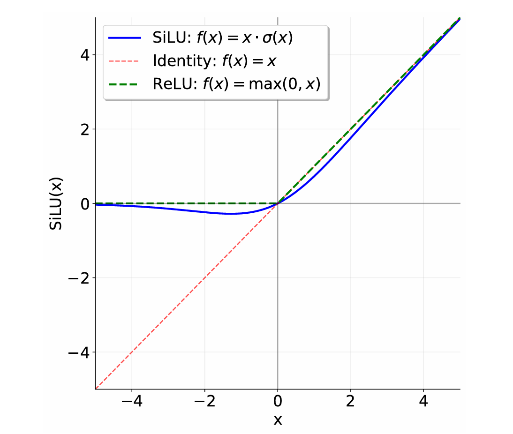
</p>

</div>

<div style="flex: 1;">


**SiLU (Sigmoid Linear Unit)**
* **Formula:** $\mathrm{SiLU}(x) = x \cdot \sigma(x)$ 
  *   Where $\sigma(x) = \frac{1}{1+e^{-x}}$ (Sigmoid).
* Smooth and **differentiable** everywhere.
* Allows non-zero gradients for negative inputs, preventing the Dying ReLU problem. 

**Swish**
* **Formula:** $\mathrm{Swish}(x) = x \cdot \sigma(\beta x)$
* SiLU is a special case of Swish where $\beta = 1$.

</div>

</div>

**Further Reading:** [Overview of Recent Activation Functions](https://vitalab.github.io/blog/2024/08/20/new_activation_functions.html)

---

## Is it enough?

**Forward Analysis:** Examining the representation capacity of the activation elements.

$$
y_i = \sigma \left( \sum_j x_j[W_1]_{ji} \right)
$$

* The output is primarily a non-linear transformation of first-order linear combinations of $W_1$. 
* It struggles to explicitly capture higher-order interactions. 

---

## Is it enough?

**Backward Analysis:** Examining the gradient flow during backpropagation.

Let $z = xW_1, y = \sigma(z)$, 

$$
\frac{\partial L}{\partial x} = \left( \frac{\partial L}{\partial y} \odot \sigma'(z) \right) \cdot W_1^T
$$

* For many common activation functions, $0<\sigma'(z)<1$.
* So if $\sigma'(z) \ll 1$, repeated element-wise multiplication over a large number of layers causes the gradients to shrink exponentially. 
  * This leads to the Vanishing Gradient Problem.

---

## Gated Linear Units (GLU)

**Solution**: Introduces a **gating** path to control information flow.
* Gate: Use a function $\sigma$ to activate the values of $xW_1$.
* Value: Do element-wise multiplication with $xV$.

$$
\mathrm{FFN}(x) = (\sigma(xW_1) \odot xV) W_2
$$

* Compared with original FFN, an element-wise gate is added to dynamically control the activations of input.
  * Called **gate activation**. 
* This structure is called **Gated Linear Units (GLU)**.

---

## Gated Linear Units (GLU)

The choice of the activation function $\sigma$ defines the specific GLU variant.

* $\text{FFN}_{\text{ReGLU}}(x, W_1, V, W_2) = (\text{ReLU}(xW_1) \odot xV) W_2$
* $\text{FFN}_{\text{GeGLU}}(x, W_1, V, W_2) = (\text{GeLU}(xW_1) \odot xV) W_2$
* $\text{FFN}_{\text{SwiGLU}}(x, W_1, V, W_2) = (\text{Swish}(xW_1) \odot xV) W_2$

Many modern LLMs are using SwiGLU as FFN (e.g., **LLaMA**).

---

## Advantage of GLU: Forward analysis

$$
y_i = \underbrace{\text{Swish}\left(\sum_k x_k W_{k,i}\right)}_{\text{Gate}} \cdot \underbrace{\left(\sum_j x_j V_{j,i}\right)}_{\text{Value}}
$$

* The output is a combination of second-order interaction terms ($c_{ij} x_i x_j$). 
* Comparing with original FFN, it can explicitly model higher-order interactions.

---

## Advantage of GLU: Backward analysis

Gradient Flow of $y=(xV) \odot \sigma(xW_1)$:
$$
\frac{\partial L}{\partial x} = \frac{\partial L}{\partial y} \Big[ \underbrace{\sigma(z) V^T}_{\text{Value Path}} + \underbrace{(xV) \odot \sigma'(z) W_1^T}_{\text{Gated Path}} \Big]
$$

* Term of gated path may still vanish since $\sigma'(z)$ may be small.
* But Term of value path is depended on value of activated gate $\sigma(z)$: 
  * If the gate is open, the gradients will flow through.

This structure effectively mitigates the vanishing gradient problem, as parameter updates are dynamically controlled by the gate.

---

## Dimension Adjustment

* Compared to the original FFN, GLU introduces an extra learnable matrix
  * The linear weights $V$.

* To maintain the same parameter count as the original FFN (where $d_{ff} = 4d_{model}$), we must reduce the dimension $d_{ff}$:

$$
d'_{ff} = \frac{2}{3} \times 4d_{model} = \frac{8}{3}d_{model}
$$

---

## PART3.2: MoE

---

## The Challenge of Scaling Dense LLMs

**The Goal:** Design a model with a massive number of parameters to increase reasoning capacity and world knowledge.

* Simply scale up the original transformer. 
* Problems: In **Dense Model**, every parameter is used for every token.
  * Larger models require massive dense matrix multiplications, meaning inference time and computational cost increase linearly with model size.

<br>

* A new method: **Mixture of Experts (MoE)**.

---

## Divide the work and be experts

In the standard Transformer, a single FFN must process all tokens. This means the single FFN should carry all kinds of modeling works simultaneously.

But in the real world, complex work is usually accomplished through division of labor, where different people take on different roles and excel in their own ways.

This is **Mixture-of-Experts (MoE)**: 

* Use multiple FFN, , each specializing in different subjects.
* For each token, a gating mechanism determines which FFNs to activate.
* For any given token, only a small subset of experts are activated.
* Total parameter count scales up massively, but the inference speed remains almost unchanged.

---

## MoE

<div style="display: flex; gap: 10px;">

<div style="flex: 0.75;">

<p align="center">
    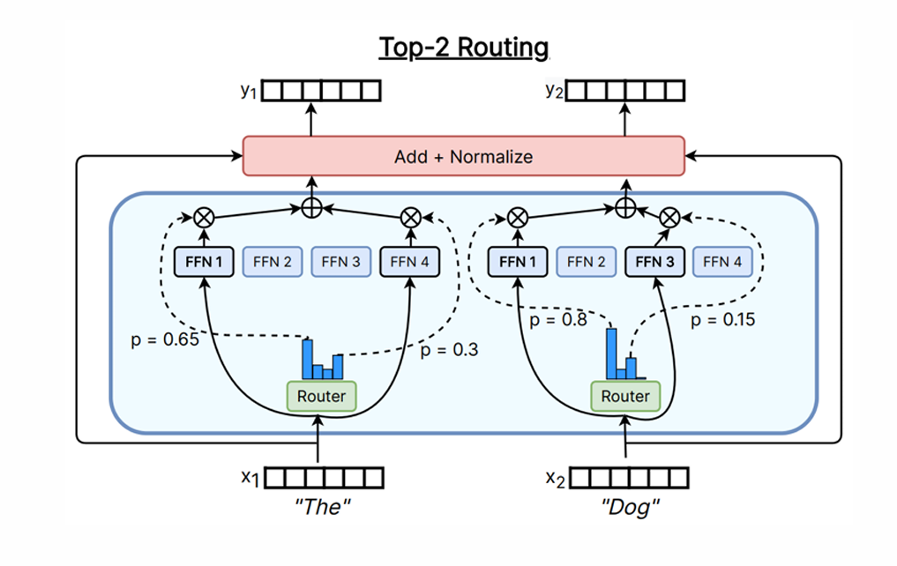
</p>

</div>

<div style="flex: 1;">

* For each token, it first enters the router layer.
* The router layer is linear layer followed by a softmax activation.
* The router selects the top-k experts (where $k$ is very small) according to the probability distribution.
* The outputs of the selected $k$ FFNs are weighted and summed to produce the final output.
* Others remain the same.

</div>

</div>

---

## More parameters and same FLOP

<p align="center">
    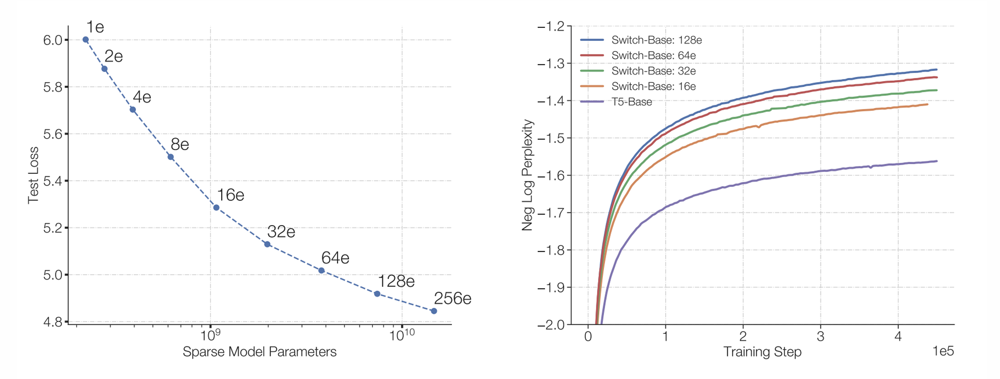
</p>

---

## PART4: Normalization

---

## PART4.1: Normalization methods

---

## Batch Normalization (Batch Norm)

**Batch**: In each training step, `batch_size` samples are processed in parallel. All input samples are packed into an input tensor containing the batch dimension.

**Batch Norm:** Normalize the input tensor across the batch dimension, based on **`batch_size` elements at the same position**.

<p align="center">
    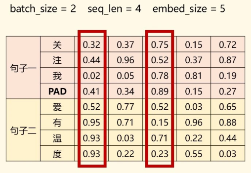
</p>

---

## Batch Normalization (Batch Norm)

$$
y_i = \gamma \cdot \frac{x_i - \mu_{\mathcal{B}}}{\sqrt{\sigma_{\mathcal{B}}^2 + \epsilon}} + \beta
$$

* $\mu_{\mathcal{B}}$ and $\sigma_{\mathcal{B}}$ are the mean and variance calculated over the current batch $\mathcal{B}$.

* We use learnable $\gamma$ and $\beta$ to restore representational capacity. 
  * Without them, the normalization would force activations into a rigid standard normal distribution, potentially limiting the model's expressivity.

---

## Batch Normalization (Batch Norm)

It is used frequently in vision models, but rarely used in LLM.

* BN couples samples together. In sequence generation, tokens should ideally be processed causally, not dependent on other sentences in the batch.
* Cause distortion of $\mu,\sigma$ for sentences with varying length (if we use padding mask).
  * We will initially let the embedding of padding token be $0$ or a certain vector, and it has no actually mean, which should not be included in calculation.
* Performance degrades significantly if the batch size is small.


---

## Layer Normalization (Layer Norm)

**Layer Norm**: Normalize the input tensor across the embedding dimension, based on **$d_\text{model}$ number of elements within the same sample**, with $\mu_i$ and $\sigma_i$ calculated. 
  * Compared with Batch Norm.

$$y_i=\frac{x_i-\mu_i}{\sqrt{\sigma_i^2+\epsilon}}\gamma_i+\beta_i$$

Used in the original Transformer and some other LLMs, such as BERT, GPT-2.

<p align="center">
    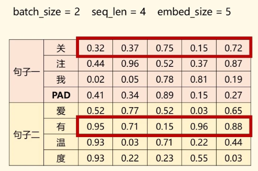
</p>

---

## Root Mean Square Layer Norm (RMSNorm)

Standard LN performs two distinct operations:
1.  **Re-centering:** Subtracting the mean ($\mu$) to make the data zero-centered.
2.  **Re-scaling:** Dividing by the standard deviation ($\sigma$) to normalize variance.

From [Root Mean Square Layer Normalization](https://arxiv.org/abs/1910.07467): 
* Through experiments, it turns out that re-centering is not so important.
* Can we remove the mean calculation to **reduce computational overhead** without hurting performance?
  * Since repeated use of LayerNorm increases computational overhead while LLMs grow larger and deeper.

---

## Root Mean Square Layer Norm (RMSNorm)

$$y_i=\frac{x_i}{\text{RMS}(x)}g_i$$
$$\text{RMS(x)}=\sqrt{\frac{1}{d}\sum_ix_i^2+\epsilon}$$

* In LayerNorm, we need to traverse the tensor twice to calculate $\mu$ and $\sigma$, while RMSNorm requires only one pass.
* Maintains comparable performance, even better in some cases.

---

## PART4.2: Normalization position

---

## Post-Norm

<p align="center">
    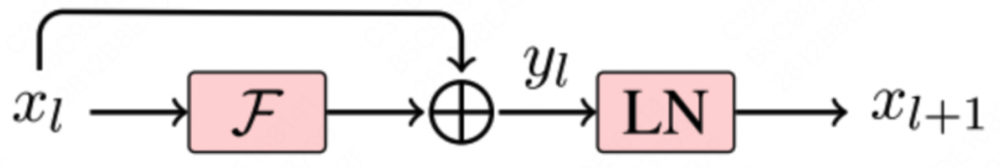
</p>

$$x_{t+1}=\text{Norm}(x_t+\text{FFN}(x_t))$$

* Normalization after calculating residual connection.

* Used in the original transformer and BERT.

---

## Post-Norm

But actually, this normalization creates significant instability during training.

**Gradient:**
$$
\frac{\partial L}{\partial x_t} = \frac{\partial L}{\partial x_{t+1}} \cdot J_{\text{norm}, l}\left( I + \frac{\partial F_t}{\partial x_t} \right)
$$

During backpropagation, the gradients are multiplied by $J_{\text{norm}}$ at every layer.
* Increases the risk of vanishing or exploding gradients.

To solve this,  almost all modern LLMs (e.g., GPT-3, LLaMA) utilize **Pre-Norm**. 

---

## Pre-Norm

$$x_{t+1}=x_t+\text{FFN}(\text{Norm}(x_t))$$

<p align="center">
    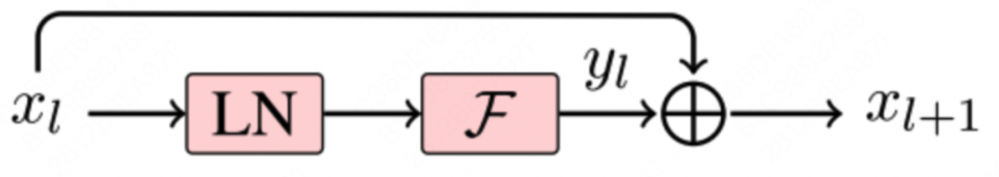
</p>


$$
\frac{\partial L}{\partial x_t}=\frac{\partial L}{\partial x_{t+1}}(I+\frac{\partial F_t}{\partial x_t})
$$

* Similar to original residual connection. 
* Reduce the danger of gradient problems.

---

## Summary of Transformer architecture and modules

<div style="display: flex; gap: 10px">

<div style="flex: 1.8;">

<p align="center">
    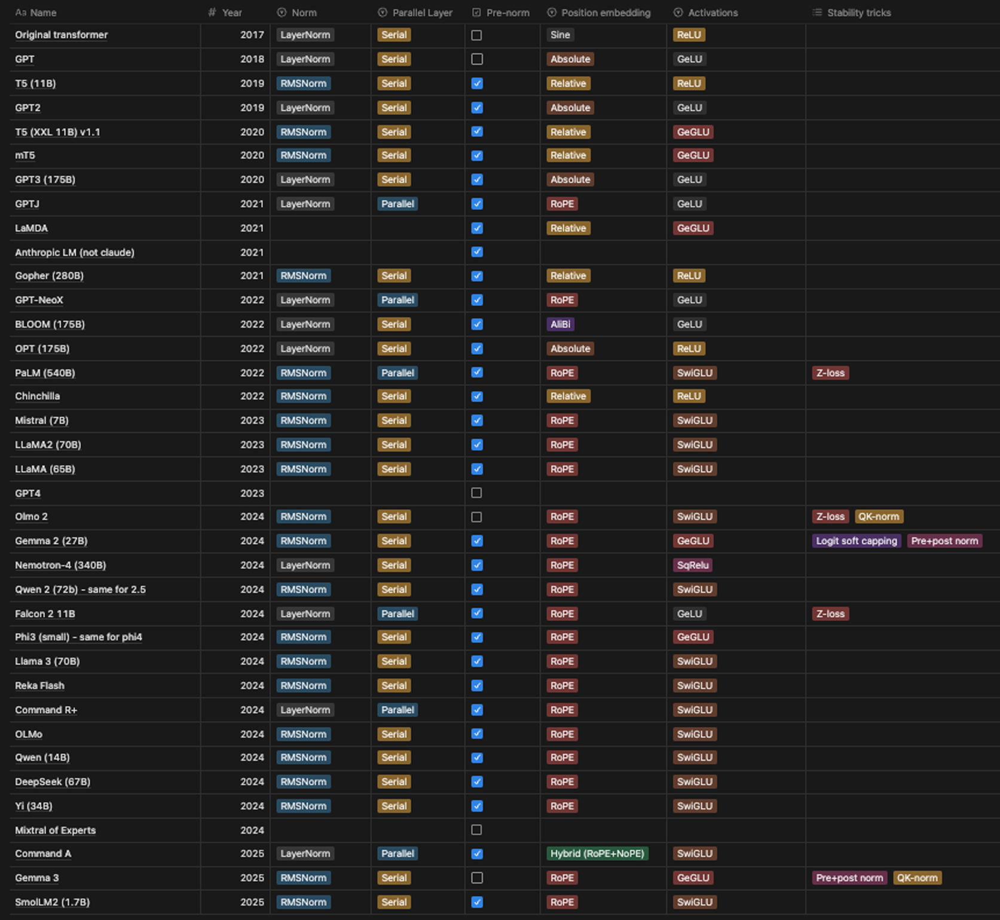
</p>

</div>

<div style="flex: 1;">

<br><br>

* Most use RMSNorm
* Most use Pre-Norm
* Most use RoPE
* Most use SwiGLU

</div>

</div>

---

## Think About It

_For normalization module, it seems that using `RMSNorm` cannot save much FLOPs since matrix calculation in other modules actually cost over $99\%$ FLOPs. So why do we still need `RMSNorm`?_

---

## LayerNorm Example

```Python
mean = x.mean(dim=-1, keepdim=True) # Pass x for the 1st time
var = x.var(dim=-1, keepdim=True)   # Pass x for the 2nd time
y = (x - mean) / sqrt(var + eps) * gamma + beta
```

* When first pass `x`, we need to load `x` from global memory to calculate `mean`.
* When pass `x` for the second time, `x` usually cannot stay in cache due to its large size and low reuse.
* Comparing with matrix calculation (with mature caching mechanism), we should frequently load from global memory, which is the main bottleneck.
* So normalization cost about $25\%$ time consumption with only $0.17\%$ FLOPs.