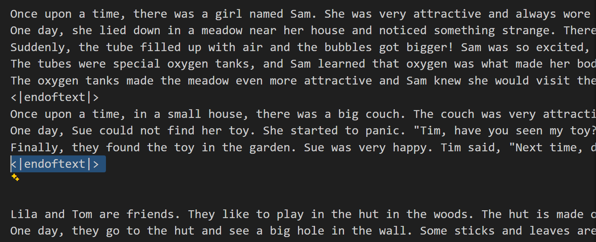

# CS190C Lec4 

Byte-Pair Encoding (BPE)

---

## Overview

* Motivation
* Naive Algorithm of BPE
* Optimize1: Merge Algorithm
* Optimize2: Encode Algorithm
* Hands-on Demonstration
* Thinking

---

## PART1: Motivation

---

## Recall: How to encode texts?

`Hello helo, I'm`

* Can we directly use language model to process it?
* How can we encode it formally?

---

## Recall: How to encode texts?

In `Lec1 - RNN` part, we've come up with a word encoding method...

* At first, each word is still encoded with a single number.
* We hope to train a matrix $W_e\in \mathbb{R}^{d\times |V|}$, each column is the embedding of i-th word.
* So for i-th word, we can get its embedding through $W_ee$, $e$ is the one-hot vector of this word (only get value 1 in i-th element) $\Rightarrow W_ee$ is the i-th column of $W_e$

---

## Recall: How to encode texts?

In fact, it is essentially a widely adopted approach across all current language models: 

* Turn text to a string of numbers losslessly
* Then, turn numbers to high dimension embeddings using embedding matrix.

**Problem: How to transform from text to numbers?**

---

## A naive idea

For different kinds of languages, we have their vocabularies...

* For example, English. We number each word in the vocabulary list, and then number punctuation, space and other symbols in the text.
* Maybe we can successfully transform using this one-to-one mapping.

---

## A naive idea

Text: `Hello helo, I'm`

Vocabulary:
```
"Hello" :0
" "     :1
"helo"  :2
","     :3
"I'm"   :4
```

We can easily encode the text into numbers: `0,1,2,3,1,4`

However, are there any possible problems of this method?

---

## Problems?

* How to build the vocabulary?
  * There are millions of words in each kind of language.
  * This size is extremely unfriendly to operation efficiency and storage space.
* There are ambiguity problems, that is: The mapping cannot always be one-to-one
  * For `United Kingdoms`, is it a single word or two words? (Both of them can be found in English vocabulary)
  * How to perform this mapping to Chinese text? `学习/大语言模型` `学习/大/语言模型` `学习/大/语言/模型` `学/习/大/语/言/模/型`
* Generalization ability?
  * Do `Dog` and `Dogs` have any connection according to this method?

---

## Another naive idea

Can we use a simple and universal rule, instead of looking at vocabulary, to separate and encode texts?

* We have UTF-8 encoding method, which has been widely used in Internet and Operating Systems to encode texts.
* Python has built-in UTF-8 encode function.

---

## Another naive idea

```Python
>>> print("h".encode("utf-8"))
b'h'
>>> print("你".encode("utf-8"))
b'\xe4\xbd\xa0'
>>> print("ô".encode("utf-8"))
b'\xc3\xb4'

>>> test_string="hello,你好"
>>> utf_encoded=test_string.encode("utf-8")
>>> print(utf_encoded)
b'hello,\xe4\xbd\xa0\xe5\xa5\xbd'
>>> list(utf_encoded)
[104, 101, 108, 108, 111, 44, 228, 189, 160, 229, 165, 189]
```

Can we use UTF-8 to directly encode texts?

---

## Pros and cons

* It can form a truly one-to-one mapping.
* We don't need to use vocabularies anymore, so it is extremely fast and costs little storage space ($\Theta(N)$ in both time and space)
* However, what are the sequence lengths of these 2 methods above?

---

## Pros and cons

* Separate directly by words: `6` $\Leftrightarrow$ UTF-8: `15`
* Sequence length grows: 
  * Leads to explosive time growth (Transformer has $\Theta(n^2)$ time complexity) and space growth
  * Information density is extremely low (need several tokens to represent meaning of a single word), causing more difficulty of learning.
  * Causes hidden trouble to embedding matrix ($W_e \in \mathbb{R}^{256\times n}$, when $n$ is very large, like 8192, we should represent 8192 dimensions of semantic meaning using just 256 vectors, which is hard to learn compared with thousands of vectors)

---

## Make a compromise?

Can we come up with a new method, such that:

* Each token can roughly represent the meaning of a whole word
* The size of vocabulary is not so large, best to be able to control it manually
* Also, we are able to follow some rules, to achieve one-to-one mapping from texts to tokens in vocabulary
* That is: Combining advantages of cutting by words and UTF-8.

---

## PART2: Naive Algorithm of BPE

https://arxiv.org/abs/1508.07909

---

## Algorithm

BPE algorithm can be considered as two parts:
* Building a vocabulary using statistical regularity
* Tokenize text by iterative merging using constructed vocabulary.

---

## Algorithm 1: Building vocabulary

* We start with the same condition as UTF-8: The mapping vocabulary has 256 items (That is UTF-8 mapping rules)
* The original tokenized text is a string of single bytes correspondingly.
* For each turn, merge the most frequent byte pair, form a new item, and add it to the vocabulary.

We should look at an example.

---

## Algorithm 1: Building vocabulary

Text: `Hello helo, I'm`

* The original vocabulary: 
```
{0: b'\x00', 1: b'\x01', 2: b'\x02', 3: b'\x03',...,
33: b'!', 34: b'"', 35: b'#', 36: b'$', 37: b'%', 38: b'&',...,
48: b'0', 49: b'1', 50: b'2', 51: b'3',...,
97: b'a', 98: b'b', 99: b'c', 100: b'd',...,
254: b'\xfe', 255: b'\xff'}
```

* Map the text:
```
72, 101, 108, 108, 111, 32, 104, 101, 108, 111, 44, 32, 73, 39, 109
That is: The text is cut to [H,e,l,l,o," ",h,e,lo," ",I,',m], and then mapping
```

---

## Algorithm 1: Building vocabulary

* Calculate byte pairs' frequency:`(e,l):2   (l,o):2   (H,e):1  (l,l):1...`
* Choose the most frequent pair with maximum lexicographical order `(l,o)`
  * merge all adjacent `(l,o)` in the text into `lo`
  * append `256: b'lo'` to the vocabulary
* The new text after merge:`H,e,l,lo, ,h,e,lo, ,I,',m`
* Pairs' frequency next turn:`(e,l):1   (e,lo):1   (lo, ):2...`
* And so on.

---

## Is it perfect so far?

* What does a real-world large corpus look like?
<p align="center">
    
</p>

There exists a special token `<|endoftext|>` , which separates different texts in the corpus.
* We should add an item in the vocabulary initially, to prevent it from being separated into individual bytes: `256: b'<|endoftext|>'`
* That is: The initial mapping vocabulary has $256+1=257$ items

---

## Is it perfect so far?

We still consider the short text/corpus: `Hello helo, I'm`

If we want to merge many turns (such as 1000), what will happen?

* The vocabulary may finally contains a "word": `b'Hello helo, I'm'`, which is meaningless.
* So, we should also set a limit for the merging outcomes, such as: no more than one complete word in a merged token.

---

## Pre-tokenization

We set the limit through "Pre-tokenization", that is:
* Chunk the corpus to several texts, bounded by `<|endoftext|>`.
* Then roughly chunk "complete words" in each text using regular expression.

We should also look at an example.

---

## Pre-tokenization

Corpus:
```
abcd abcd abcd abcd abcd tech tech<|endoftext|>

Héllò hôw <|endoftext|><|endoftext|> are ü? 
```
* Chunk to texts:
```
chunk a text: b'abcd abcd abcd abcd abcd tech tech'
chunk a text: b'<|endoftext|>'
chunk a text: b'\n\nH\xc3\xa9ll\xc3\xb2 h\xc3\xb4w '
chunk a text: b'<|endoftext|>'
chunk a text: b'<|endoftext|>'
chunk a text: b' are \xc3\xbc? '
```

---

## Pre-tokenization

* Chunk to words using `regex`:

```
GPT2_SPLIT_PATTERN = r"""'(?:[sdmt]|ll|ve|re)| ?\p{L}+| ?\p{N}+| ?[^\s\p{L}\p{N}]+|\s+(?!\S)|\s+"""
```

How does it chunk words?

* `'(?:[sdmt]|ll|ve|re)`: Grab abbreviation such as `'s` `'d` `'ll` `'ve`
* ` ?\p{L}+`: Grab zero or one space before words such as `tech` and ` tech`
* ` ?\p{N}+`: Grab zero or one space before numbers such as `123` and ` 123`
* ` ?[^\s\p{L}\p{N}]+`:Grab zero or one space before continuous symbols such as `?!` and ` ?!`
* `\s+(?!\S)`: Grab continuous whitespace after words; `\s+`: Grab other whitespace

---

## Pre-tokenization

* Chunk the example corpus to words

<div style="display: flex; gap: 10px;">

<div style="flex: 1;">

```
chunk a text: b'abcd abcd abcd abcd abcd tech tech'
>>>>>split a token: b'abcd'
>>>>>split a token: b' abcd'
>>>>>split a token: b' abcd'
>>>>>split a token: b' abcd'
>>>>>split a token: b' abcd'
>>>>>split a token: b' tech'
>>>>>split a token: b' tech'

chunk a text: b'<|endoftext|>'
>>>>>split a token: b'<|endoftext|>'
```

</div>

<div style="flex: 1;">

```
chunk a text: b'\n\nH\xc3\xa9ll\xc3\xb2 h\xc3\xb4w '
>>>>>split a token: b'\n'
>>>>>split a token: b'\n'
>>>>>split a token: b'H\xc3\xa9ll\xc3\xb2'
>>>>>split a token: b' h\xc3\xb4w'
>>>>>split a token: b' '

chunk a text: b'<|endoftext|>'
>>>>>split a token: b'<|endoftext|>'

chunk a text: b'<|endoftext|>'
>>>>>split a token: b'<|endoftext|>'

chunk a text: b' are \xc3\xbc? '
>>>>>split a token: b' are'
>>>>>split a token: b' \xc3\xbc'
>>>>>split a token: b'?'
>>>>>split a token: b' '
```

</div>

</div>

---

<p align="center" style="font-size: 1.5em;">
<strong> Code explanation: Pre-tokenization </strong>
</p>

---

## Merge loops

Workflow now:

* Pre-tokenization to generate roughly "complete" words
* Turn the corpus to single bytes as UTF-8 method
* Each loop:
  * Check each "complete" word, count byte-pair frequency within "complete" words
  * Merge a byte-pair as original BPE merging method
  * Walk through the corpus to merge these byte pairs
  * And so on

We should also look at an example.

---

## Merge loops

For corpus `Hello helo, I'm`:

* Build initial vocabulary whose size is $256+1=257$ (Including `b'<|endoftext|>'`)
* Pre-tokenization to `Hello` ` helo` `,` ` I` `'m`
* The corpus now: [`H e l l o`,`' ' h e l o`,`,`,`' ' I`,`' m`]
* Calculate byte pairs: `(e,l):2` `(l,o):2` `(H,e):1` ...
  * Tips:`(o,' ')` was 1 without pre-tokenization but 0 now; same for `(o, ',')`. 
* Choose `(l,o)`
  * Append the vocabulary:`257:(l,o)`
  * The corpus now: [`H e l lo`,`' ' h e lo`,`,`,`' ' I`,`' m`]
* Next loop

---

## Algorithm 1: Building vocabulary

Final vocabulary:
```
418: b' by', 419: b'os', 420: b'ant', 421: b' G', 422: b' from',
423: b'ive', 424: b' al', 425: b"'s", 426: b' su', 427: b'el',
...
5569: b' turning', 5570: b' Please', 5571: b' Chief', 5572: b' quant'
...
9801: b' Elizabeth', 9802: b'igate', 9803: b'TR', 9804: b' cognitive'
```
* Root & minor word $\Rightarrow$ Frequent words $\Rightarrow$ Proper noun & other words
* We can merge almost all frequent roots and words through just tens of thousands vocabulary size
* So we can directly embed frequent words, and embed infrequent words using 2-3 roots

---

## Algorithm 2: Tokenize

---

## What we've done

* A vocabulary containing tens of thousands of words
* A list of merging sequence (such as `[(b'h', b'e'), (b' ', b't'), (b' ', b'a'), (b' ', b's'), (b' ', b'w'), (b'n', b'd')...]`)

But there still exists a problem:

* The vocabulary may contains items `me` `th` `od` `method`, how can we tokenize word `method`? $\Rightarrow$ Just looking at vocabulary cannot lead to one-to-one mapping.

---

## Tokenize step 1: merging

For a certain corpus:
* Pre-tokenize first
* Walk through merging sequence list in order:
  * For each item (a byte pair), searching for all pre-tokens of corpus to find byte pairs like the item
  * Merge all of them
  * Next loop

We will also look at an example.

---

## Tokenize step 1: merging

Merging list:`[(b' ', b't'), (b' ', b'a'), (b'n', b' '), (b'h', b'e'), (b'i', b'n'), (b'r', b'e'), (b' t', b'he'), (b'o', b'n'), (b'e', b'r')]` 
Corpus:`in the`
* Pre-tokenized corpus:`[i,n] [' ',t,h,e]`
* Looking at item `(b' ', b't')`:
  * [**' ',t**,h,e] $\Rightarrow$ merge to `[ t,h,e]`
* Looking at item `(b' ', b'a')`:
  * No such pair in the corpus, pass  
* Looking at item `(b'n', b' ')`
  * Although `in the` has adjacent `n ` pair, it isn't really adjacent after pre-tokenization, so we skip it.

---

## Tokenize step 1: merging

By walking through all items of the merging list and merging all adjacent pairs, we can get the proper merging outcomes of the corpus.

* The outcome of the example above is `[in] [ the]`. You can verify it by yourself.

---

## Tokenize step 2: encode

Finally, we should transfer these merged tokens to numbers.

It is extremely easy, we only need to refer to the vocabulary, which contains tokens and their numbers. 
Also, all tokens we merged can be found in vocabulary (Why?)

So far, we've completed the whole BPE workflow.

---

## Problem: Time consumption?

In real practice, we may use corpus with size of hundreds of MB...

* In algorithm 1 (building vocabulary), we should walk through the whole corpus during each merge loop
* In algorithm 2 (tokenize), we should walk through whole corpus during each merge loop

The time consumption is catastrophic.

We should optimize the algorithm to make it faster.

---

## PART3: Merge Algorithm (Optimize 1)

---

## What's the problem of the naive algorithm?

During each merging loop,
* Only a small part of the corpus should change
* But we walk through the whole corpus to find what should be changed
* We also walk through the whole corpus to change them

---

## What should we hope？

* Maintain information of all token pairs, so we can update pairs precisely
* Maintain counted number of pairs, so we can directly find pair to merge

---

## What should we maintain?

* Information of pairs: maintain a double linked list
  * Position mapping of all tokens
  * Position mapping of all pairs
  * Position mapping of previous token & next token
* Counted number of pairs: maintain a priority queue

We will look at an example, the corpus is still:

```
abcd abcd abcd abcd abcd tech tech<|endoftext|>

Héllò hôw <|endoftext|><|endoftext|> are ü? 
```

---

## Position mapping of all tokens：`token_dict`

<div style="display: flex; gap: 10px; font-size: 0.83em;">

<div style="flex: 1;">

```
idx:0,char:b'a'
idx:1,char:b'b'
idx:2,char:b'c'
idx:3,char:b'd'
idx:4,char:b' '
idx:5,char:b'a'
idx:6,char:b'b'
idx:7,char:b'c'
idx:8,char:b'd'
idx:9,char:b' '
idx:10,char:b'a'
idx:11,char:b'b'
idx:12,char:b'c'
idx:13,char:b'd'
idx:14,char:b' '
idx:15,char:b'a'
idx:16,char:b'b'
idx:17,char:b'c'
```

</div>

<div style="flex: 1;">

```
idx:18,char:b'd'
idx:19,char:b' '
idx:20,char:b'a'
idx:21,char:b'b'
idx:22,char:b'c'
idx:23,char:b'd'
idx:24,char:b' '
idx:25,char:b't'
idx:26,char:b'e'
idx:27,char:b'c'
idx:28,char:b'h'
idx:29,char:b' '
idx:30,char:b't'
idx:31,char:b'e'
idx:32,char:b'c'
idx:33,char:b'h'
idx:47,char:b'\n'
idx:48,char:b'\n'
idx:49,char:b'H'
```

</div>

<div style="flex: 1;">

```
idx:50,char:b'\xc3'
idx:51,char:b'\xa9'
idx:52,char:b'l'
idx:53,char:b'l'
idx:54,char:b'\xc3'
idx:55,char:b'\xb2'
idx:56,char:b' '
idx:57,char:b'h'
idx:58,char:b'\xc3'
idx:59,char:b'\xb4'
idx:60,char:b'w'
idx:61,char:b' '
idx:88,char:b' '
idx:89,char:b'a'
idx:90,char:b'r'
idx:91,char:b'e'
idx:92,char:b' '
idx:93,char:b'\xc3'
idx:94,char:b'\xbc'
idx:95,char:b'?'
idx:96,char:b' '
```

</div>

</div>

---

## Position mapping of all pairs: `pair_positions`

<div style="display: flex; gap: 15px;">

<div style="flex: 1;">

```
pair:(97, 98),char:(b'a', b'b'),positions:[0, 5, 10, 15, 20]
pair:(98, 99),char:(b'b', b'c'),positions:[1, 6, 11, 16, 21]
pair:(99, 100),char:(b'c', b'd'),positions:[2, 7, 12, 17, 22]
pair:(32, 97),char:(b' ', b'a'),positions:[4, 9, 14, 19, 88]
pair:(32, 116),char:(b' ', b't'),positions:[24, 29]
pair:(116, 101),char:(b't', b'e'),positions:[25, 30]
pair:(101, 99),char:(b'e', b'c'),positions:[26, 31]
pair:(99, 104),char:(b'c', b'h'),positions:[27, 32]
pair:(72, 195),char:(b'H', b'\xc3'),positions:[49]
pair:(195, 169),char:(b'\xc3', b'\xa9'),positions:[50]
pair:(169, 108),char:(b'\xa9', b'l'),positions:[51]
pair:(108, 108),char:(b'l', b'l'),positions:[52]
```

</div>

<div style="flex: 1;">

```
pair:(108, 195),char:(b'l', b'\xc3'),positions:[53]
pair:(195, 178),char:(b'\xc3', b'\xb2'),positions:[54]
pair:(32, 104),char:(b' ', b'h'),positions:[56]
pair:(104, 195),char:(b'h', b'\xc3'),positions:[57]
pair:(195, 180),char:(b'\xc3', b'\xb4'),positions:[58]
pair:(180, 119),char:(b'\xb4', b'w'),positions:[59]
pair:(97, 114),char:(b'a', b'r'),positions:[89]
pair:(114, 101),char:(b'r', b'e'),positions:[90]
pair:(32, 195),char:(b' ', b'\xc3'),positions:[92]
pair:(195, 188),char:(b'\xc3', b'\xbc'),positions:[93]
```

</div>

</div>

---

## `prev` and `next`

Just show the example of `prev`

<div style="display: flex; gap: 8px;">

<div style="flex: 1;">

```
idx:0, char:b'a', prev_idx:None, prev_char:None
idx:1, char:b'b', prev_idx:0, prev_char:b'a'
idx:2, char:b'c', prev_idx:1, prev_char:b'b'
idx:3, char:b'd', prev_idx:2, prev_char:b'c'
idx:4, char:b' ', prev_idx:None, prev_char:None
idx:5, char:b'a', prev_idx:4, prev_char:b' '
idx:6, char:b'b', prev_idx:5, prev_char:b'a'
idx:7, char:b'c', prev_idx:6, prev_char:b'b'
idx:8, char:b'd', prev_idx:7, prev_char:b'c'
idx:9, char:b' ', prev_idx:None, prev_char:None
idx:10, char:b'a', prev_idx:9, prev_char:b' '
idx:11, char:b'b', prev_idx:10, prev_char:b'a'
idx:12, char:b'c', prev_idx:11, prev_char:b'b'
idx:13, char:b'd', prev_idx:12, prev_char:b'c'
idx:14, char:b' ', prev_idx:None, prev_char:None
idx:15, char:b'a', prev_idx:14, prev_char:b' '
idx:16, char:b'b', prev_idx:15, prev_char:b'a'
idx:17, char:b'c', prev_idx:16, prev_char:b'b'
idx:18, char:b'd', prev_idx:17, prev_char:b'c'
```

</div>

<div style="flex: 1;">

```
idx:19, char:b' ', prev_idx:None, prev_char:None
idx:20, char:b'a', prev_idx:19, prev_char:b' '
idx:21, char:b'b', prev_idx:20, prev_char:b'a'
idx:22, char:b'c', prev_idx:21, prev_char:b'b'
idx:23, char:b'd', prev_idx:22, prev_char:b'c'
idx:24, char:b' ', prev_idx:None, prev_char:None
idx:25, char:b't', prev_idx:24, prev_char:b' '
idx:26, char:b'e', prev_idx:25, prev_char:b't'
idx:27, char:b'c', prev_idx:26, prev_char:b'e'
idx:28, char:b'h', prev_idx:27, prev_char:b'c'
idx:29, char:b' ', prev_idx:None, prev_char:None
idx:30, char:b't', prev_idx:29, prev_char:b' '
idx:31, char:b'e', prev_idx:30, prev_char:b't'
idx:32, char:b'c', prev_idx:31, prev_char:b'e'
idx:33, char:b'h', prev_idx:32, prev_char:b'c'
idx:47, char:b'\n', prev_idx:None, prev_char:None
idx:48, char:b'\n', prev_idx:None, prev_char:None
idx:49, char:b'H', prev_idx:None, prev_char:None
idx:50, char:b'\xc3', prev_idx:49, prev_char:b'H'
```

</div>

<div style="flex: 1;">

```
idx:51, char:b'\xa9', prev_idx:50, prev_char:b'\xc3'
idx:52, char:b'l', prev_idx:51, prev_char:b'\xa9'
idx:53, char:b'l', prev_idx:52, prev_char:b'l'
idx:54, char:b'\xc3', prev_idx:53, prev_char:b'l'
idx:55, char:b'\xb2', prev_idx:54, prev_char:b'\xc3'
idx:56, char:b' ', prev_idx:None, prev_char:None
idx:57, char:b'h', prev_idx:56, prev_char:b' '
idx:58, char:b'\xc3', prev_idx:57, prev_char:b'h'
idx:59, char:b'\xb4', prev_idx:58, prev_char:b'\xc3'
idx:60, char:b'w', prev_idx:59, prev_char:b'\xb4'
idx:61, char:b' ', prev_idx:None, prev_char:None
idx:88, char:b' ', prev_idx:None, prev_char:None
idx:89, char:b'a', prev_idx:88, prev_char:b' '
idx:90, char:b'r', prev_idx:89, prev_char:b'a'
idx:91, char:b'e', prev_idx:90, prev_char:b'r'
idx:92, char:b' ', prev_idx:None, prev_char:None
idx:93, char:b'\xc3', prev_idx:92, prev_char:b' '
idx:94, char:b'\xbc', prev_idx:93, prev_char:b'\xc3'
idx:95, char:b'?', prev_idx:None, prev_char:None
idx:96, char:b' ', prev_idx:None, prev_char:None
```

</div>

</div>

---

## Counted number of pairs: `pair_counter`

<div style="display: flex; gap: 10px;">

<div style="flex: 1;">

```
pair:(97, 98),char:(b'a', b'b'),count:5
pair:(98, 99),char:(b'b', b'c'),count:5
pair:(99, 100),char:(b'c', b'd'),count:5
pair:(32, 97),char:(b' ', b'a'),count:5
pair:(32, 116),char:(b' ', b't'),count:2
pair:(116, 101),char:(b't', b'e'),count:2
pair:(101, 99),char:(b'e', b'c'),count:2
pair:(99, 104),char:(b'c', b'h'),count:2
pair:(72, 195),char:(b'H', b'\xc3'),count:1
pair:(195, 169),char:(b'\xc3', b'\xa9'),count:1
pair:(169, 108),char:(b'\xa9', b'l'),count:1
```

</div>

<div style="flex: 1;">

```
pair:(108, 108),char:(b'l', b'l'),count:1
pair:(108, 195),char:(b'l', b'\xc3'),count:1
pair:(195, 178),char:(b'\xc3', b'\xb2'),count:1
pair:(32, 104),char:(b' ', b'h'),count:1
pair:(104, 195),char:(b'h', b'\xc3'),count:1
pair:(195, 180),char:(b'\xc3', b'\xb4'),count:1
pair:(180, 119),char:(b'\xb4', b'w'),count:1
pair:(97, 114),char:(b'a', b'r'),count:1
pair:(114, 101),char:(b'r', b'e'),count:1
pair:(32, 195),char:(b' ', b'\xc3'),count:1
pair:(195, 188),char:(b'\xc3', b'\xbc'),count:1
```

</div>

</div>

---

## Merge loop now

* Choose token pair `(pair0,pair1)` to merge using `pair_counter`
* Walk through all positions of this pair using `pair_positions`
  * Check this position (to be discussed later)
  * get `prev_token` (previous token of `pair0`), `next_token` (next token of `pair1`)
  * update `pair_counter` of related pairs, simulate merge operation
  * update `token_idx` of `pair0`,`pair1`
  * update `pair_positions` of related pairs, but **add only, not delete**
  * update `prev`, `next`
* Update `pair_counter`'s priority queue, also use lazy update

An example...

---

## Merge `(b'a',b'b')`

<div style="font-size: 0.96em">

* Choose `(b'a',b'b')` and simulate merging it to `new=b'ab'`
* For all positions of `(b'a',b'b')`
  * Check the position truly contains `b'a'` and `b'b'`
  * get `prev_token` and `next_token`
  * update counter of `(prev_token,b'a')``(prev_token,new)``(b'b',next_token)``(new,next_token)`
  * `token_idx` of this `b'b'`becomes `None`, `token_idx` of this `b'a'` becomes `b'ab'`
  * `pair_positions` of `(prev_token,new)``(new,next_token)` add new positions(lazy update)
  * `next` of `b'ab'`'s position and `prev` of `next_token` change
* The heap: insert all related pairs and counted numbers (lazy update)
  
</div>

---

<p align="center" style="font-size: 1.5em;">
<strong> Code explanation: Optimization for Merge Algorithm </strong>
</p>

---

## PART4: Encode Algorithm (Optimize 2)

---

## Reverse Thinking

```
corpus1: tech → ["tech"]
corpus2: tech tech → ["tech"," tech"]
```

* Since we've pre-tokenized the corpus, pre-tokens will not affect each other
* So can we merge the corpus pre-token by pre-token?
* For each pre-token, it needs only a few times of merge. How can we find the merge sequence?
  * Each time, find all token pairs, and find pairs' numbers in the list
  * Choose the earliest one to merge
  * And so on

---

## Reverse Thinking

<div style="display: flex; gap: 10px;">

<div style="flex: 1;">

```
Pre-token: " tech"
Initial bytes: [b' ', b't', b'e', b'c', b'h']

>>>>>pair:(b' ', b't'),number:0
>>>>>pair:(b't', b'e'),number:465
>>>>>pair:(b'e', b'c'),number:505
>>>>>pair:(b'c', b'h'),number:98
finish a merge,token_list:[b' t', b'e', b'c', b'h']

>>>>>pair:(b' t', b'e'),number:287
>>>>>pair:(b'e', b'c'),number:505
>>>>>pair:(b'c', b'h'),number:98
finish a merge,token_list:[b' t', b'e', b'ch']
```

</div>

<div style="flex: 1;">

```
>>>>>pair:(b' t', b'e'),number:287
>>>>>pair:(b'e', b'ch'),number:2614
finish a merge,token_list:[b' te', b'ch']

>>>>>pair:(b' te', b'ch'),number:5739
finish a merge,token_list:[b' tech']

finish a merge,token_list:[b' tech']

encode number: 596
```

</div>

</div>

---

<p align="center" style="font-size: 1.5em;">
<strong> Code explanation: Optimization for Encode Algorithm </strong>
</p>