# CS190C Lec5
Build Transformer Decoder

---

<div style="font-size: 1.5em;">

**Attention please**: The only content removed from these slides is the code implementation of each module.

</div>

---

## Overview

- Macro System Architecture
- Code Implementation of Basic Computational Components
- Code Implementation of RoPE
- Code Implementation of FFN and Attention
- Assembly of Transformer Block and Final Model

---

## PART1: Macro System Architecture

---

## Decoder-Only Transformer Overall Architecture Diagram

<p align="center">
    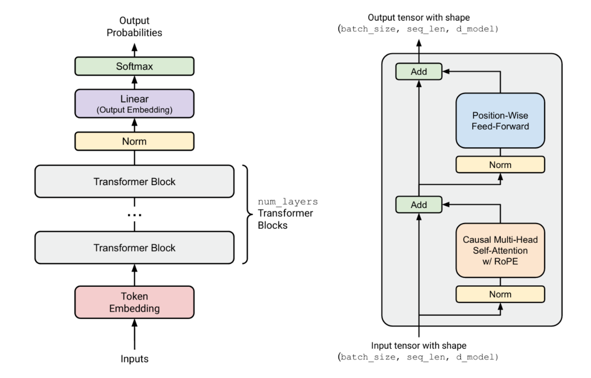
</p>

---

## Modules of the whole Transformer

<div style="display: flex; gap: 10px;">

<div style="flex: 1;">

<p align="center">
    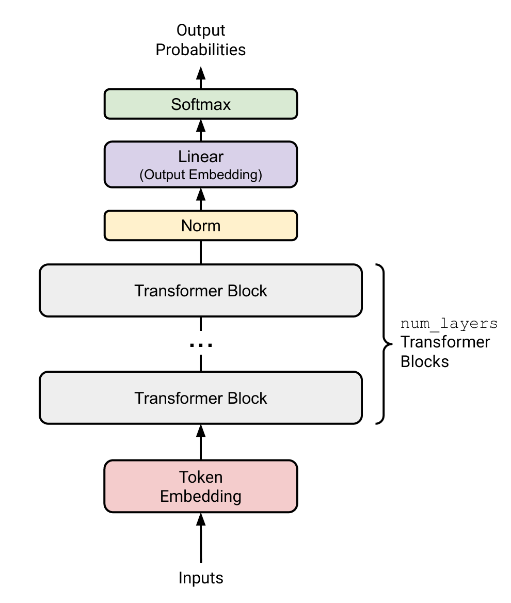
</p>

</div>

<div style="flex: 1;">

* Pass through a `Token Embedding` module to convert to a dense vector (Input layer)
* Pass through several `Transformer Block` modules to absorb information in multiple rounds (Hidden layer)
* Normalize the numerical scale of the final tensor
* Apply a linear transformation to calculate possible scores for generating each word (Output layer)

</div>

</div>

---

## Modules of each Transformer Block

<div style="display: flex; gap: 10px;">

<div style="flex: 1;">

<p align="center">
    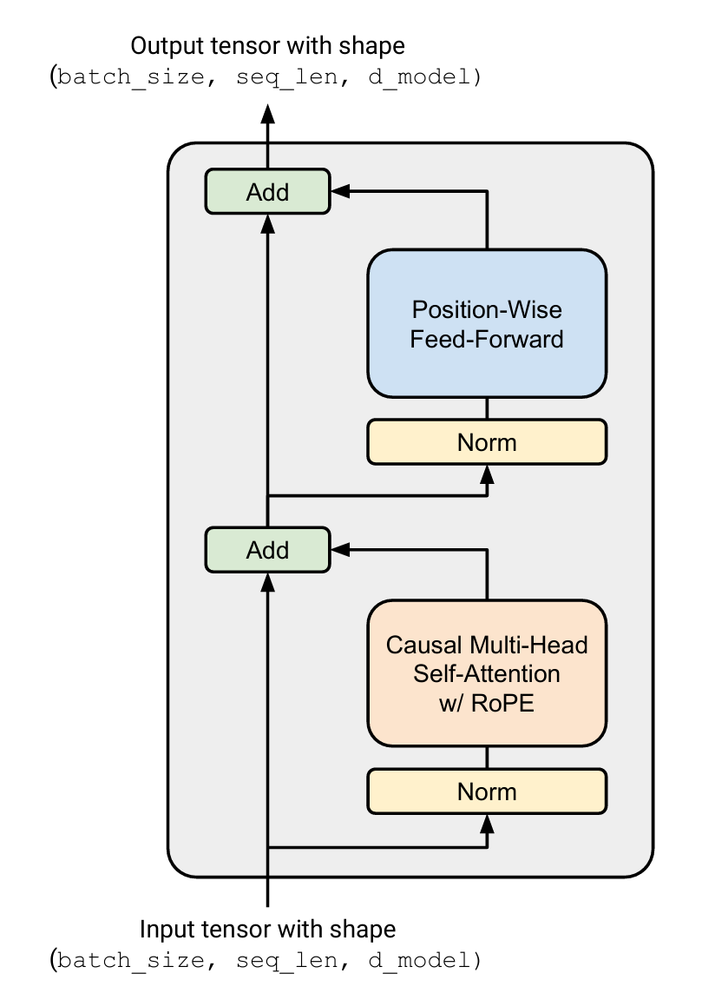
</p>

</div>

<div style="flex: 1;">

* Pre-layer RMSNorm module
* MHA Module with Residual Connection
  * contains a RoPE module if positional embedding is needed
  * contains a Softmax module for computing the attention score
* Pre-layer RMSNorm module
* FFN Module with Residual Connection
  * contains SiLU module

</div>

</div>

Moreover, almost all modules require using the **linear transformation** module!

---

## PART2: Code Implementation of Basic Computational Components

---

## Basic Components to be Implemented

<div style="display: flex; gap: 20px;">
<div style="flex: 1.5;">

<p align="center">
    
</p>

</div>

<div style="flex: 1;">

<br>

**Modules to be implemented**:
* `Token Embedding`
* `Linear`
* `RMSNorm`
* `SiLU`
* `Softmax`

</div>

</div>

---

## 1. `class Generate_Embeddings`

<div style="font-size: 0.88em;">

IDEA:
- Most original input: BPE encoding results (e.g., `[3,10,2,6,4]`, all token IDs from the vocabulary)
- Tensor shape: `[batch_size, seq_len]`
- Expected model input: Different words in the vocabulary have different embedding vectors $\text{emb}_i \in \mathbb{R}^{d_\text{model}}$
- Implementation idea: 
  * Generate a learnable matrix $W_e \in \mathbb{R}^{|V|\times d_\text{model}}$.
  * The $i$-th column represents $\text{emb}_i$
  * Randomly initialized $W_e$, representing no prior knowledge about the meaning of any word at first.
  * Learn $W_e$ with other parameters during the training process.

</div>

---

## 1. `class Generate_Embeddings`

Parameter scheme:
- Initialization phase: Pass in `vocab_size`, `d_model`, `device` (the device where PyTorch tensors are stored), and `dtype` (numerical type of tensor elements).
- Forward phase:
  - Pass in `token_ids` (shape `[batch_size, seq_len]`)
  - Output shape is `[batch_size, seq_len, d_model]`

---

## 1. `class Generate_Embeddings`

```Python

[CODE EXPUNGED]

```

---

## 2. `class Linear_Transform`

IDEA:
- Assume we need to transform a 3-dimensional tensor into a 6-dimensional one...
- Mathematically speaking: Let the 3D tensor `x` ($1\times 3$) right-multiply a $3\times 6$ matrix `W`
- The shape of `xW` is then $1\times 6$, just like the diagram below.

<p align="center">
    
</p>

Question: Linear operations are the most frequent in LLMs...

**Can this operation be accelerated as much as possible?**

---

## 2. `class Linear_Transform`

- PyTorch tensors follow the "last dimension elements have contiguous memory addresses" principle.

<div style="display: flex; gap: 20px;">
<div style="flex: 1;">

- For a $3\times 6$ tensor W, its memory layout is shown in the diagram (same color means contiguous):

</div>

<div style="flex: 0.5;">

<p align="center">
    
</p>

</div>

</div>

- For a $4\times 3\times 6$ tensor (`[batch size, rows, columns]`), every 6 elements are also contiguous (e.g., the memory address difference between `[1,1,1]` and `[1,1,2]` is 1 unit, while the difference between `[1,1,1]` and `[1,2,1]` is 6 units).
- That is: Matrix elements in the same row have contiguous memory, while those in the same column do not $\Rightarrow$ **Row-major order principle**.

---

## 2. `class Linear_Transform`

<p align="center">
    
</p>

Perform 6 vector dot product operations. In each operation:
- `x` participates as a whole row, memory is contiguous, can fully utilize cache
- `W` participates as a whole column, memory is not contiguous, may not utilize cache effectively

How can we make `W` also participate "as a whole row" in each operation?

---

## 2. `class Linear_Transform`

<p align="center">
    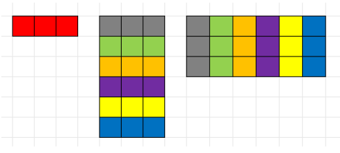
</p>

- PyTorch's transpose operation does not change the tensor's underlying memory layout, only the step size (Can you give an example?)
- Create new `W`: `[6,3]` (every 3 elements are contiguous in memory)
- Transpose `W` to `[3,6]`: Can perform matrix multiplication, and the memory distribution remains unchanged
- `x` and `W` have fully contiguous memory access during each operation, allowing full utilization of cache!

---

## 2. `class Linear_Transform`

```Python

[CODE EXPUNGED]

```

---

## 3. `class RMSNorm`

<div style="font-size: 0.9em;">

IDEA: Normalize the input tensor $\mathbf{a}$ (We've discussed why at `Lec3`)
- $\mathbf{a}_i=\frac{\mathbf{a}_i}{\mathrm{RMS}(\mathbf{a})}g_i$ (divide by normalization weight uniformly, and apply learnable fine-tuning)
- $g_i$ is a learnable parameter
- $\mathrm{RMS}(\mathbf{a})=\sqrt{(\frac{1}{d_{model}}\sum{\mathbf{a}_i^2})+\epsilon} \quad\text{(Root Mean Square)}$ 

Input tensor shape: `[batch_size, seq_len, d_model]` $\Rightarrow$ Not a 1D vector, how to handle? 
* **PyTorch's broadcasting mechanism**: 
  * By default, operations are performed on the last few dimensions, while operations across earlier dimensions are equivalent to replication.
  * Equivalent to parallel operations on `batch_size * seq_len` parallel `d_model`-dimensional tensors.
  * Just process it as a 1D vector `[d_model]`!

</div>

---

## 3. `class RMSNorm`

<div style="font-size: 0.95em;">

```Python

[CODE EXPUNGED]

```

</div>

---

## 4. `class SiLU_Activation`

<div style="display: flex; gap: 15px">

<div style="flex: 1;">

<p align="center">
    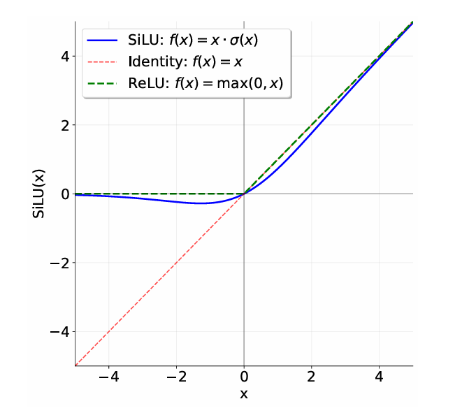
</p>

</div>

<div style="flex: 1;">

$\text{SiLU:} f(x)=x·\sigma(x)$
$\text{ReLU:} f(x)=\text{max}(0,x)$

* For $x<0$: roughly equals to $0$
* For $x>0$: roughly stays the same
* Compare with ReLU: smooth and differentiable at $x=0$

</div>

</div>

---

## 4. `class SiLU_Activation`

```Python

[CODE EXPUNGED]

```

---

## 5. `class Softmax_Activation`

How to turn a score tensor to a distribution?
$$x_i=\frac{e^{x_i}}{\sum{e^{x_j}}}$$
- Each $x_i$ calculates its exponential as a weight, then performs weight normalization
- Can make the advantage of relatively larger values more pronounced
- Even smaller values remain non-zero after normalization

Problem: What if there exists a very large $x_i$? (e.g., normalizing `[20,3,1005]`)
- $e^{1000}$ = `NAN`

---

## 5. `class Softmax_Activation`

- Normalizing `[100,101,102]` vs Normalizing `[-2,-1,0]`
- Weight of 102: 
  $$\frac{e^{102}}{e^{102}+e^{101}+e^{100}} = \frac{e^{0}}{e^{0}+e^{-1}+e^{-2}}$$
- The Softmax normalization result of `[100,101,102]` is equivalent to that of `[-2,-1,0]`

---

## 5. `class Softmax_Activation`

Let $x_\mathrm{max}$ be the maximum value among $x_i$: 

$$
\begin{aligned}
\mathrm{Softmax}(x_i) &= \frac{e^{x_i}}{\sum{e^{x_j}}} \\
    &= \frac{e^{x_i}/e^{x_\mathrm{max}}}{\sum{e^{x_j}}/e^{x_\mathrm{max}}} \\
    &= \frac{e^{x_{i}-x_\mathrm{max}}}{\sum{e^{x_j-x_\mathrm{max}}}}
\end{aligned}
$$

**Safe Softmax**: Subtract $x_\mathrm{max}$ from all $x_i$ to avoid problems with extremely large values that cannot be calculated!

---

## 5. `class Softmax_Activation`

```Python

[CODE EXPUNGED]

```

---

## PART3: Code Implementation of RoPE

---

## Review: RoPE Calculation Rules

Apply the rotation: $\bm{x} \mapsto \bm{R}^i\bm{x}$.
* Given an embedding $\bm{x} \in \mathbb{R}^d$ (where $d$ is even) at position $i$:
* Divide the $d$-dimensional vector into $d/2$ pairs (2D sub-spaces).
* Rotate each pair by an angle $\theta_{i,k}$.
$$
\bm{R}^i =
\begin{bmatrix}
\bm{R}^i_1 & 0 & 0 & \cdots & 0 \\
0 & \bm{R}^i_2 & 0 & \cdots & 0 \\
0 & 0 & \bm{R}^i_3 & \cdots & 0 \\
\vdots & \vdots & \vdots & \ddots & \vdots \\
0 & 0 & 0 & \cdots & \bm{R}^i_{d/2}
\end{bmatrix},
\quad \text{where}
\begin{cases}
\bm{R}^i_k =
\begin{bmatrix}
\cos(\theta_{i,k}) & -\sin(\theta_{i,k}) \\
\sin(\theta_{i,k}) & \cos(\theta_{i,k})
\end{bmatrix}, \\
\theta_{i,k} = \dfrac{i}{\Theta^{2k/d}} .
\end{cases}
$$

---

## Review: RoPE Calculation Rules

$$
\bm{R}^i =
\mathrm{diag}\left(\bm{R}^i_1, \bm{R}^i_2, \dots, \bm{R}^i_{d/2} \right),
\text{where }
\bm{R}^i_k =
\begin{bmatrix}
\cos(\theta_{i,k}) & -\sin(\theta_{i,k}) \\
\sin(\theta_{i,k}) & \cos(\theta_{i,k})
\end{bmatrix},
$$

The attention score with RoPE depends only on relative position.

* Property of rotation matrix $\bm{R}$: $\bm{R}^m(\bm{R}^n)^T = \bm{R}^{m-n}$
  * Transpose = inverse, Multiplication → Addition of powers. 

* In attention mechanism, given a query $\bm{q}_i$ at position $i$ and a key $\bm{k}_j$ at position $j$:
  $$\bm{q}'_i = \bm{R}^i\bm{q}_i, \quad \bm{k}'_j = \bm{R}^j\bm{k}_j$$
  $$(\bm{q}'_i)^T \bm{k}'_j = \bm{q}_i^T (\bm{R}^i)^T \bm{R}^j \bm{k}_j = \bm{q}_i^T \bm{R}^{j-i} \bm{k}_j$$

</div>

---

## How to Avoid Brute-force Matrix Multiplication?

* Observation: Even rows of the matrix correspond to the same transformation rule: `[cos, -sin]`, with angle $\theta_{i,k}$ as the variable
* If these even rows that share the same rule can be computed efficiently in a unified manner, how should subsequent processing proceed?
<p align="center">
    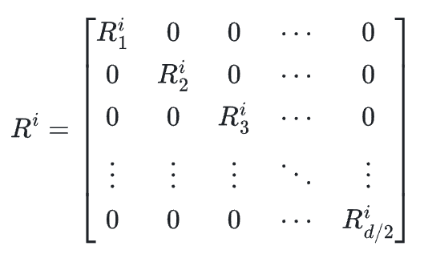
    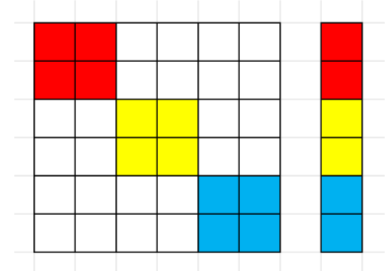
    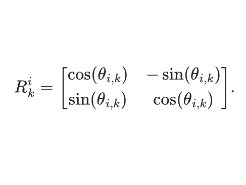
    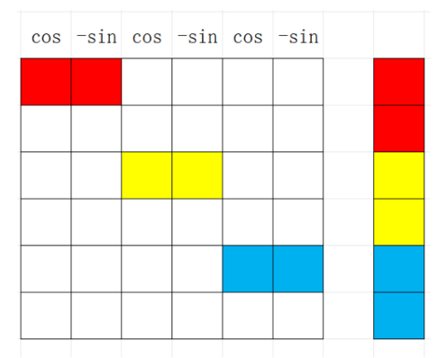
</p>

---

## How to Avoid Brute-force Matrix Multiplication?

- Calculate products of `Red-Red`, `Yellow-Yellow`, `Blue-Blue`, 
  - which correspond to: $x_0, x_2, x_4$ after RoPE
- The same applies to $x_1, x_3, x_5$.
- Construct 2-number blocks of $\bm{R}_i$, and calculate block-wise dot products.

<p align="center">

</p>

---

## How to Construct 2-number blocks of $\bm{R}_i$?

- Pre-calculate a $\theta_{i,k}$ lookup table of size `[max_seq_len, d/2]`
- Then calculate lookup tables of the same size for $\cos(\theta_{i,k})$ and $\sin(\theta_{i,k})$
- Obtain values at positions 1, 3, 5 directly from the cos lookup table
- Obtain values at positions 2, 4, 6 directly from the sin lookup table

<p align="center">
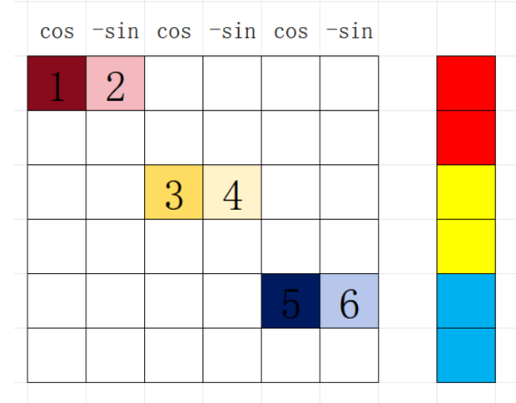
</p>

---

## How to Construct 2-number blocks of $\bm{R}_i$?

- Concatenate pairs `(1,2)`, `(3,4)`, `(5,6)` into 3 blocks, perform block-wise dot product with the 3 blocks of `x`, obtaining the values for the three even rows.
- Similarly, obtain the values for all odd rows of the transformed `x`, concatenate both to get the complete transformed `x` vector.

<p align="center">
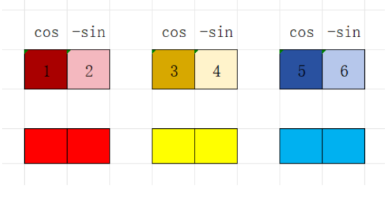
</p>

---

## Code Implementation of RoPE

<div style="font-size: 0.75em;">

```Python

[CODE EXPUNGED]

```

</div>

---

## Code Implementation of RoPE

```Python

[CODE EXPUNGED]

```

---

## PART4: Code Implementation of FFN and Attention

---

## 1. `class Feed_Forward_Network`

Module algorithm (excluding residual connection):
- Input tensor `x` (`d_model` dimensional)
- Route 1: Transform via `W1` to `d_ff` dimensional, pass through `SiLU` activation function to get new `x`
- Route 2: Transform via `W3` for another expansion, obtaining another `d_ff`-dimensional tensor
- Perform element-wise multiplication of two tensors to obtain a new `x`
- Transform back to `d_model` dimensional via `W2`

We call it `SwiGLU`: 
$$\mathrm{FFN}(x)=\mathrm{SwiGLU}(x,W_1,W_2,W_3)$$

---

## 1. `class Feed_Forward_Network`

```Python

[CODE EXPUNGED]

```

---

## 1. `class Feed_Forward_Network`

```Python

[CODE EXPUNGED]

```

---

## 2. `class Multihead_Attention`

Module algorithm (excluding residual connection):
- Input tensor `x` with size `[batch_size, seq_len, d_model]`
- Through three linear transformations, each `d_model`-dimensional word vector of `x` is projected to obtain:
  - `Q`, `K` matrices `[batch_size, seq_len, num_heads*d_k]`
  - `V` matrix `[batch_size, seq_len, num_heads*d_v]`
- Perform `RoPE` positional encoding on `Q`, `K` matrices
- Generate attention upper triangular mask (to prevent breaking the "autoregressive" assumption)
- Use QKV matrices and attention mask to compute attention output

---

## 2. `class Multihead_Attention`

Method for calculating attention output:
- Multiply `Q`, `K` matrices to calculate token feature matching scores
- Apply mask processing to the matching score matrix
- $\mathrm{Softmax}(\frac{QK^T}{\sqrt{d_k}})$, calculate attention scores between tokens
- Multiply the score matrix by the `V` matrix to get the attention output of each head
- Multiply by the `W_O` matrix to integrate the heads

---

## Calculation of Attention Output for One Head

```Python

[CODE EXPUNGED]

```

---

## Generation of Attention Mask

<div style="font-size: 0.75em;">

```Python

[CODE EXPUNGED]

```

</div>

<p align="center">
    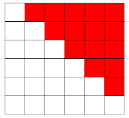 
</p>

---

## List of Sub-modules in Multihead_Attention

- Attention mask generation module
- Attention output calculation module (SDPA)
- RoPE module $\Rightarrow$ Requires additional parameters like `max_seq_len`, `theta`, `token_positions`, etc.
- Four types of linear transformations: `Q`, `K`, `V`, `O`

---

## Assembly of Complete Module

<div style="font-size: 0.8em;">

```Python

[CODE EXPUNGED]

```

</div>

---

## Assembly of Complete Module

```Python

[CODE EXPUNGED]

```

---

## Assembly of Complete Module

```Python

[CODE EXPUNGED]

```

---

## PART5: Assembly of Transformer Block and Final Model

---

## Structure of Transformer Block

<div style="display: flex; gap: 10px">

<div style="flex: 1;">

<p align="center">
    
</p>

</div>

<div style="flex: 1;">

* An RMSNorm module
* An MHA module
* Residual connection
* Another RMSNorm module
* An FFN module
* Residual connection

The parameters received by each Block consist of all parameters required by the modules listed above!
</div>

</div>

---

## Assembly of Transformer Block

```Python

[CODE EXPUNGED]

```

---

## Assembly of Transformer Block

```Python

[CODE EXPUNGED]

```

---

## Structure of Full Transformer

<div style="display: flex; gap: 10px">

<div style="flex: 1;">

<p align="center">
    
</p>

</div>

<div style="flex: 1;">

<br><br>

* A Token Embedding module
* Several Transformer Block modules
* A RMSNorm module
* The Final Linear Transformation module

</div>

</div>

---

## Assembly of Complete Transformer

<div style="display: flex; gap: 10px">

<div style="flex: 1;">

```Python

[CODE EXPUNGED]

```

</div>

<div style="flex: 1;">

```Python

[CODE EXPUNGED]

```

</div>

</div>

---

## Assembly of Complete Transformer

```Python

[CODE EXPUNGED]

```
