# CS190C Lec6
Training and Autoregressive Decoding

---

## Overview

- Model Training: Macro System Architecture
* Training modules
    - Data Sampling Module
    - AdamW Optimizer
    - Training Auxiliary Modules
    - Checkpoints
* Training and Decoding
  * Start of Training: Input Parameter Decoding
  * Complete script
  * Autoregressive Decoding

---

## PART1 - Model Training: Macro System Architecture

---

## Overview of Model Training Process

- Determine the total number of iterative optimization steps. For each step:
  - Sample input text and standard output.
  - Forward.
  - Calculate loss function value.
  - Calculate gradients and clipping.
  - Schedule the learning rate.
  - Update parameters.
- It is recommended to output real-time status during the process, such as the current loss function value.

---

## Modules to Implement

- Input & Standard output data  $\Rightarrow$ `Data Sampling` Module
- Loss calculation $\Rightarrow$ `Cross-Entropy Loss` Module
- Calculate and process Gradients $\Rightarrow$ `Gradient Clipping` Module
- Parameter Optimization $\Rightarrow$ `Learning Rate Scheduler` Module, `AdamW` Optimizer Module
- `Checkpoint` Module, `Pre-decoding` Module

---

## PART2: Data Sampling Module

---

## Memory Issues with Very Large Corpus

- The corpus will initially be encoded to a long string of numbers using BPE.
- To sample a part of it as a "sentence", a naive method is to read the whole long string into memory, and sample hundreds of numbers.
- If the corpus is extremely large, reading all of them will bring disaster to memory.

<br>
<p align="center">
    
</p>

---

## Memory Issues with Very Large Corpus

- Is there a solution that reads only specific parts needed from disk to memory?
* `numpy.memmap`: A list that interacts directly with disk space for reading and writing, and which is highly similar to a regular list in other aspects. 
* We can implement `class Memmap_Manager`, containing `def save_as_memmap` and `def load_by_range`, for disk-oriented read/write operations.
* The core idea is: Store the whole long string on disk, only read a small part of it into memory according to our needs.

---

## Ideas

We can implement this idea roughly...
* Suppose the whole long string contains $500,000,000$ numbers.
* We can cut it into small chunks, each chunk's length= $500,000$.
* Store these $10000$ chunks on disk.
* Suppose we need to read from $2000$-th to $8000$-th number, what chunks should we load into memory? 
  * $490,000$-th to $1,050,000$-th ?
* These two phases correspond to `def save_as_memmap` and `def load_by_range`.

---

## 1. `def save_as_memmap`

- Use `BPE_Tokenizer`'s `encode_iterable`, reading only a single number each time.
- Continuously read numbers into a buffer list.
- When the buffer reaches a certain size (e.g., $500,000$ numbers), write it as a whole block to disk.
- Clear the buffer and continue reading and writing blocks until the corpus is finished.
- Count the total number of integer codes in the corpus during the process.

That is: **saving as encoding**.

---

## 1. `def save_as_memmap`

```Python

[CODE EXPUNGED]

```

---

## 1. `def save_as_memmap`

```Python

[CODE EXPUNGED]

```

For np.memmap:
- Define array type and shape in advance.
- Operate like a regular array, still stored in memory.
- Explicit flush operation writes to disk, freeing the previously allocated memory automatically.

---

## 1. `def save_as_memmap`

<p align="center">
    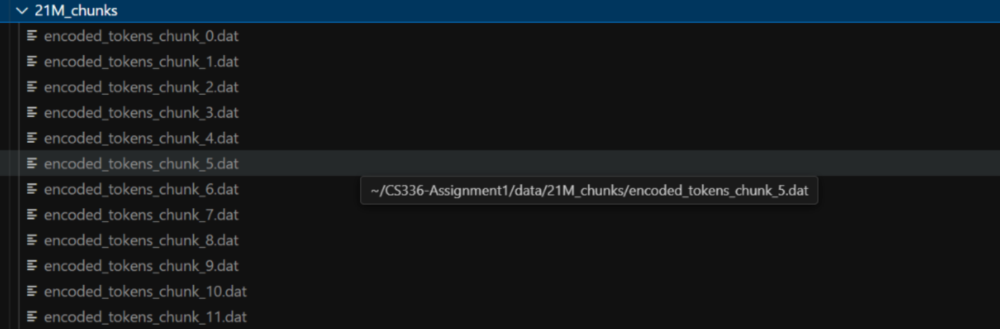
    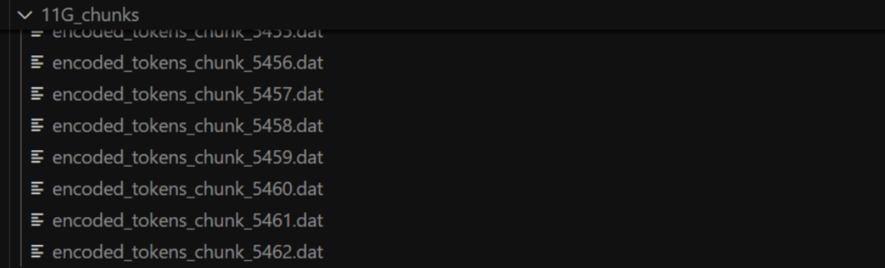
</p>


**Attempting to load such a large complete list into memory is catastrophic!**

---

## 2. `def load_by_range`

Requirement: We need to read all elements in the range `[start_idx, end_idx)` of the encoded list.
- Calculate: Which chunks covered?
- Load only corresponding intervals into memory.
- Operations are consistent with regular lists, except for declaring the `np.memmap` type.

---

## 2. `def load_by_range`

`memmap_arr[idx_in_start:idx_in_end]`: Loads this interval from disk into memory.

```Python

[CODE EXPUNGED]

```

---

## 3. Formal Sampling Operation: `class Batch_By_Memmap`

<div style="font-size: 0.9em;">

### Problem1: How to sample input data?

Assuming a corpus length of 10 and a single sampling sequence length of 4:
- Dense sampling: 1234; 2345; 3456; ...
  - Too much data. If the total number of training steps is small (i.e., 3 samples), the second half of the corpus might not be covered.
- Sequential sampling: 1234; 5678; ...
  - Some data is missing. E.g., cannot get 3456 as training input.
- Compromise: Random sampling
  - Randomly pick a start point (ensuring it's <= 7), then continuously sample 4 characters from the start point.
  - Usually sample `batch_size` sequences simultaneously, so randomly pick `batch_size` start points to sample.

<div>

---

## 3. Formal Sampling Operation: `class Batch_By_Memmap`

### Problem2: What is the standard output?
- Recall what the LLM does: each vector is finally linearly projected to `vocab_size`-dimensional scale weights to predict the word at the next position (as the diagram below).
- So the standard output of position-$i$ should be the $(i+1)$-th word in the corpus!
- That is: if the input sequence is 1234, the standard output should be 2345.

<p align="center">
    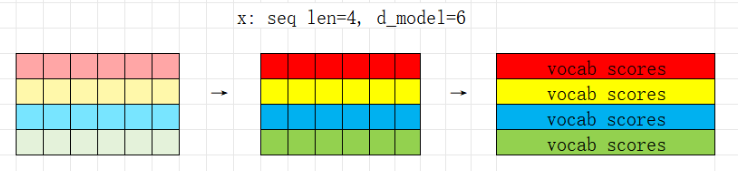
</p>

---

## 3. Formal Sampling Operation: `class Batch_By_Memmap`

```Python

[CODE EXPUNGED]

```

---

## PART3: AdamW Optimizer

---

## 1. From `SGD` to `AdamW`

SGD: $\theta=\theta-\alpha \nabla L(\theta)$

<p align="center">
    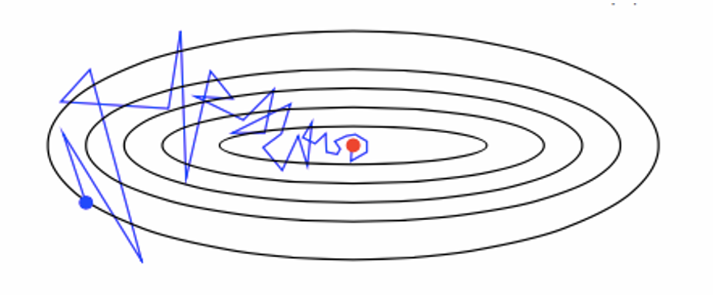
</p>

---

## 1. From `SGD` to `AdamW`

What's the defect of SGD?

* Zig-zagging since the gradient may not be stable.
* Shares the same learning rate for all parameter updates. 
  * Some parameter, such as word embedding of `the`, may update repeatedly and significantly, leading to possible oscillation.
  * Some parameter, such as word embedding of `pneumoconiosis`, may rarely update, leading to little optimization.

---

## 1. From `SGD` to `AdamW`

What `AdamW` does?

* Use first moment `m` (called **"momentum"**) to record historical gradient information.
* Use second moment `v` to record historical gradient fluctuation information.
* Use the first and second moments to adjust the parameter update process.

---

## 1. From `SGD` to `AdamW`

Let gradient of step $t$ be $g_t$:

$$m_t=\beta_1(m_{t-1}-g_t)+g_t$$

It means: $m_t=(1-\beta_1)\sum_{\tau=1}^t{\beta_1^{t-\tau}g_{\tau}}$, which is the exponential weighting of historical gradients.

We use $m_t$ as the "gradient" of step $t$ instead of $g_t$, reducing zig-zagging of gradient. $m_t$ can now hardly fluctuate as severely.

<p align="center">
    
</p>

---

## 1. From `SGD` to `AdamW`

$$v_t=\beta_2(v_{t-1}-g_t^2)+g_t^2$$

It means: $v_t=(1-\beta_2)\sum_{\tau=1}^t{\beta_2^{t-\tau}g_{\tau}^2}$, which is the **exponential weighting** of historical square of gradients.

Additionally, it can be understood as: Variance given $\mathrm{Mean}=0$ and exponential weights. But what if $\mathrm{Mean}\neq 0$?

Suppose a sequence of gradients with the same mean value: `2,2,2,2` `3,1,3,1`, we find `3,1,3,1` still leads to larger value of $v$. So it can reflect the fluctuation of historical gradients.

---

## 1. From `SGD` to `AdamW`

So how do we use this information to adjust $\theta_t=\theta_{t-1}-\alpha g_t$?

* For the first moment, change $g_t$ to $m_t$
* How to make use of second moment?
  * If $v$ is large: It means the gradient of the parameter fluctuates significantly, such as for the word embedding of high-frequency words. The update step should be smaller.
  * If $v$ is small: It means the parameter rarely updates, for example, the historical gradients are `0,0,0,1,0,0`. The update step should be larger.

$$\theta_t=\theta_{t-1}-\alpha \frac{m_t}{\sqrt{v_t}+\epsilon} $$

---

## 1. From `SGD` to `AdamW`

$$\theta_t=\theta_{t-1}-\alpha \frac{m_t}{\sqrt{v_t}+\epsilon} $$

Is there any hidden problem with it?

When $t$ is small...

* $m_1=(1-\beta_1)g_1$, $m_2=\beta_1(1-\beta_1)g_1+(1-\beta_1)g_2 \dots$
* Suppose all $|g_i|$ share the similar scale, so $|m_1|=(1-\beta_1)|g|,$ $|m_2|=(1-\beta_1^2)|g|$ $,\dots,|m_t|=(1-\beta_1^t)|g|$ $\Rightarrow$ The scale is distorted compared with $|g|$
* The same with $|v_t|$: $|v_t|=\sqrt{1-\beta_2^t}|g|$

---

## 1. From `SGD` to `AdamW`

Fix the scale distortion: $m_t \Rightarrow \frac{m_t}{1-\beta_1^t}$, $v_t \Rightarrow \frac{v_t}{\sqrt{1-\beta_2^t}}$

That is:
$$\theta_t=\theta_{t-1}-\alpha \frac{\sqrt{1-\beta_2^t}}{1-\beta_1^t} \frac{m_t}{\sqrt{v_t}+\epsilon}$$

We can implement it in engineering:

$$
\begin{aligned}
\alpha_t &= \alpha \frac{\sqrt{1-\beta_2^t}}{1-\beta_1^t} \\
\theta_t &= \theta_{t-1}-\alpha_t \frac{m_t}{\sqrt{v_t}+\epsilon}
\end{aligned}
$$

---

## 1. From `SGD` to `AdamW`

It is the adjustment of SGD without regularization. 
* What if we consider L2-regularization (weight decay)?
* Recall: L2-regularization penalizes large weights to improve generalization.

$$
\begin{aligned}
\qquad& L_\text{total}(\theta) = L_\text{task}(\theta)+\frac{\lambda}{2}\|\theta\|_2^2 \\ 
\implies& \theta=\theta-\alpha \nabla L_\text{total}(\theta) \\
\implies& \theta=\theta-\alpha \nabla L_\text{task}(\theta)-\alpha \lambda \theta
\end{aligned}
$$

* However, the regularization complicates the adaptive method in `Adam` when we consider the gradient of $L_\text{total}$.  
  * `Adam` scales gradients adaptively, L2 regularization is scaled as well, making the effective weight decay parameter-dependent instead of constant $\lambda$ .
---

## 1. From `SGD` to `AdamW`

It is the adjustment of SGD without regularization. 
* What if we consider L2-regularization (weight decay)?
* However, the regularization complicates the adaptive method in `Adam`. 

So in `AdamW`, we use decoupled weight decay:

$$
\begin{aligned}
\theta_t &= \theta_{t-1}-\alpha \frac{\sqrt{1-\beta_2^t}}{1-\beta_1^t} \frac{m_t}{\sqrt{v_t}+\epsilon} {\color{blue} - \alpha \lambda \theta }\\ 
&=\theta_{t-1}-\alpha_t \frac{m_t}{\sqrt{v_t}+\epsilon} {\color{blue} - \alpha \lambda \theta }
\end{aligned}
$$

---

## 1. From `SGD` to `AdamW`

What is the order of magnitude of the update scale?

Assumption: When the training process enters the middle and late stages, 
* The gradient $|g|$ can be considered as a sequence with $\mathrm{Mean}=0$ and $\mathrm{Variation}=\sigma^2$ $\implies |g| \to \Theta(\sigma)$
* The adaptive learning rate $\alpha_t \to \alpha$

<br>

SGD:
$$
|\alpha g_t|=\Theta(\alpha \sigma)
$$

---

## 1. From `SGD` to `AdamW`

Suppose $|g| \to \Theta(\sigma), \alpha_t \to \alpha$, for AdamW:

$$
\begin{aligned}
\left| \alpha_t \frac{m_t}{\sqrt{v_t}+\epsilon} \right| &= \Theta\left( \alpha_t \frac{\sum_{k=1}^t\beta_1^k|g|_{t-k}}{\sqrt{\sum_{k=1}^t\beta_2^k|g|^2_{t-k}}} \right) \\
|m_t| &= \sum_{k=1}^t\beta_1^k|g|_{t-k}=\Theta(\sigma) \\
|\sqrt{v_t}| &=\sqrt{\sum_{k=1}^t\beta_2^k|g|^2_{t-k}}=\Theta\left(\sqrt{\sigma^2}\right)=\Theta(\sigma)
\end{aligned}
$$

Then $\left|\alpha_t \frac{m_t}{\sqrt{v_t}+\epsilon}\right|=\Theta(\alpha)$, which is only related to base learning rate.

---

## 2. `torch.optim.Optimizer` Base Class

Any implementation of a custom optimizer inherits from the `torch.optim.Optimizer` base class. 
The Optimizer base class provides two-level management for all model parameters:
- `self.param_groups`: Group parameters. Each group can set different features like learning rate. (First-level management: parameter grouping, sharing states within the group)
- Each `param_groups` contains at least the default key-value pair: `"params"`, corresponding to a list of parameters. Other key-value pairs like `"lr"` can also be customized.
- For each parameter in the parameter list, various states can also be set, e.g., iteration step `"step"`. (Second-level management: finer-grained states for individual parameters)

---

## 2. `torch.optim.Optimizer` Base Class

```Python

[CODE EXPUNGED]

```

---

## 3. `class AdamW_Optimizer`

<div style="display: flex; gap: 10px">

<div style="flex: 1;">

<p align="center" style="display: flex; flex-direction: column; justify-content: center; height: 100%;">
    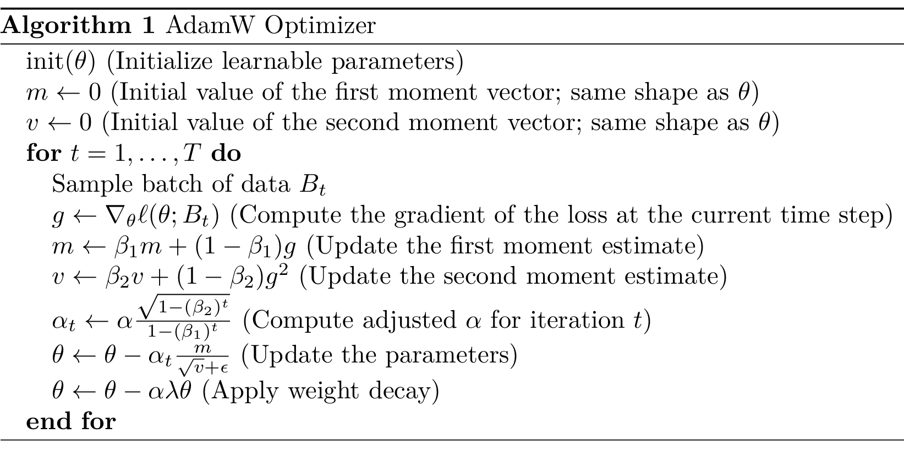
</p>

</div>

<div style="flex: 1.5;">

```Python

[CODE EXPUNGED]

```

</div>

</div>

---

## PART4: Training Auxiliary Modules

---

## 1. `class Cross_Entropy_Calculator`

Review: What the LLM does, and what it means.

- Transformer output shape is `[bsz, seq_len, vocab_size]`. There are `(bsz*seq_len)` output predictions, each prediction is "the probability score $s_i$ for each word at the next position".
- Perform Softmax to get the probability distribution $p_i$ of the next word.

<p align="center">
    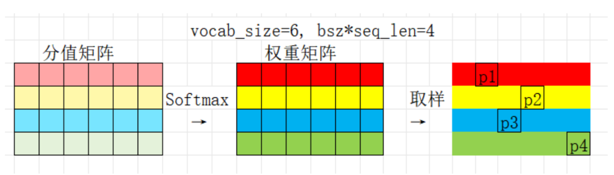
</p>

---

## 1. `class Cross_Entropy_Calculator`

- Take $-\text{log}$ of the probability weight to get $l_i=-\log(p_i)$
- the mean of all $l_i$ is the **cross-entropy loss**.
- $\text{Loss}=\text{Mean}\{-l_i\}=\text{Mean}\{-\log p_i\}=\text{Mean}\{-\log\operatorname{Softmax}(s_i)\}$

<p align="center">
    
</p>

---

## 1. `class Cross_Entropy_Calculator`

**Numerical hazard: What if $p_i$ is too small and approximated as 0?** 
* Suppose token1's 6-word weight scores are `100, -1, 1, 5, 2, 1000`, and the standard output is word2, with score `-1` and weight `0`.
* Calculation result: $\log 0=\text{NAN}$

Formula derivation: 
$$
\begin{aligned}
\operatorname{logSoftmax}(s_i) &= \log \frac{\exp(s_i)}{\sum{\exp(s_k)}} \\ 
&= \log \frac{\exp(s_i-s_\mathrm{max})}{\sum{\exp(s_k-s_\mathrm{max})} } \\ 
&= (s_i-s_\mathrm{max}) - \log \left(\sum{\exp(s_k-s_\mathrm{max})}\right) 
\end{aligned}
$$

---

## 1. `class Cross_Entropy_Calculator`

```Python

[CODE EXPUNGED]

```

---

## 1. `class Cross_Entropy_Calculator`

```Python

[CODE EXPUNGED]

```

---

## 2. `class Gradient_Clipper`

Suppose the gradient of a parameter is too large?

* SGD: $|\alpha g_t|=\Theta(\alpha |g|)$. It may lead to failure of optimization.
* AdamW: $\left|\alpha_t \frac{m_t}{\sqrt{v_t}+\epsilon}\right|=\Theta(\alpha)$. It seems like there is no problem?

Review: $v_t$ of AdamW: $v_t=(1-\beta_2)\sum_{\tau=1}^t{\beta_2^{t-\tau}g_{\tau}^2}$

* $v_t$ becomes extremely large over the next hundreds of steps.
* $\alpha_t \frac{m_t}{\sqrt{v_t}+\epsilon} \to 0$, which means the optimization stops abnormally.

So when the gradient is too large, we need to scale it to a small enough level.

---

## 2. `class Gradient_Clipper`

Suppose all parameters of a model come from 5 Linear_Transform (5D to 5D), then the model has 5 parameter tensors (all of $5\times 5$ shape). 
After one round of backpropagation, suppose the gradients of all 5 parameters are equal to:

```
tensor([[1., 1., 1., 1., 1.],
        [1., 1., 1., 1., 1.],
        [1., 1., 1., 1., 1.],
        [1., 1., 1., 1., 1.],
        [1., 1., 1., 1., 1.]])
```

Let the parameter tensors be $p_1,p_2,p_3,p_4,p_5$. $\|\nabla p_i\|_2=\sqrt{25*1}=5$

So the grad norm is $\sqrt{\sum_{i=1}^5{\|\nabla p_i\|_2^2}}=\sqrt{125}=11.18$

---

## 2. `class Gradient_Clipper`

- Assuming the acceptable upper limit is `max_norm`=$0.01$:
- All parameters must be multiplied by the scaling factor $\frac{\text{max\_norm}}{g+\epsilon}$ to ensure the total L2 norm of the gradients remains within a reasonable range.
- After clipping, the gradients of each parameter are $11.18/0.01$ times smaller:

```
tensor([[0.0009, 0.0009, 0.0009, 0.0009, 0.0009],
        [0.0009, 0.0009, 0.0009, 0.0009, 0.0009],
        [0.0009, 0.0009, 0.0009, 0.0009, 0.0009],
        [0.0009, 0.0009, 0.0009, 0.0009, 0.0009],
        [0.0009, 0.0009, 0.0009, 0.0009, 0.0009]])
```

---

## 2. `class Gradient_Clipper`

```Python

[CODE EXPUNGED]

```

---

## 3. `class Learning_Rate_Scheduler`

Throughout the model training process, the learning rate is not constant:

<p align="center">
    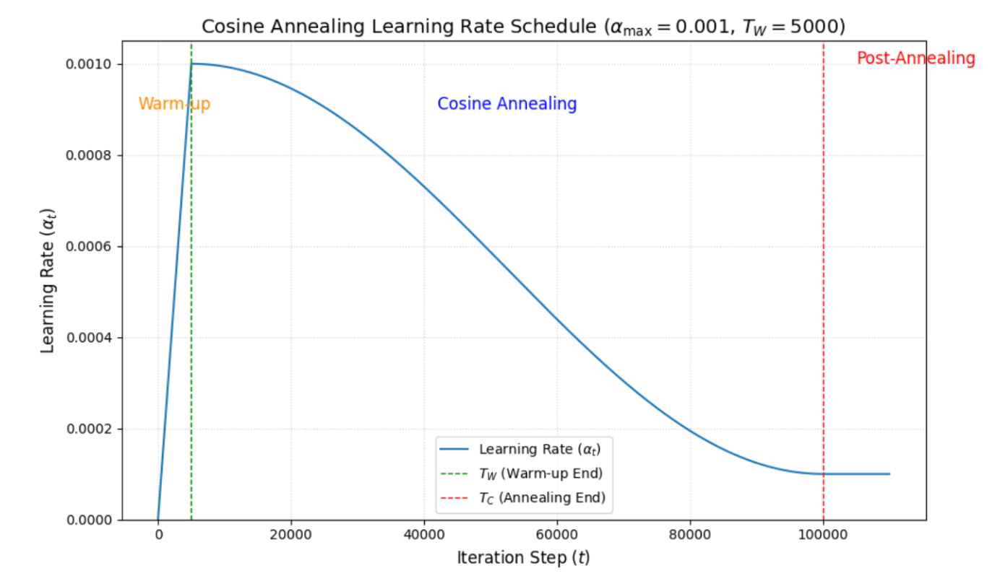
</p>

---

## 3. `class Learning_Rate_Scheduler`

```Python

[CODE EXPUNGED]

```

---

## PART5: Checkpoints

---

## A hidden problem

Usually we need hours or even days to train a large model...

Can we ensure there's nothing wrong during the whole process?

* For example, the computing power resource you applied for has been preempted, and everything crashed immediately.

To address this issue, we try to save the model every once in a while.

This is `checkpoint`.

---

## What to save and load?

* Model parameters
* Optimizer parameters and states (such as $m_t$ and $v_t$)
* Current iteration step

We need to get them first, and try to save them as files on disk.

---

## 1. How to Get All Parameters?

- PyTorch has a built-in `state_dict()` function that stores all parameters of the PyTorch module in dictionary form.

<div style="display: flex; gap: 10px">

<div style="flex: 1;">

```Python
lm = Transformer_LM(
    d_model=512,
    num_heads=8,
    d_ff=2048,
    vocab_size=10000,
    num_layers=2,
    max_seq_length=128,
    theta=10000,
    dtype=torch.float32,
    device="cpu"
)

states = lm.state_dict()
for state_key in states:
    print(state_key, states[state_key].shape)
```

</div>

<div style="flex: 1;">

```Python
transformer_blocks.0.RMSNorm_Attn.g torch.Size([512])
transformer_blocks.0.RMSNorm_FF.g torch.Size([512])
transformer_blocks.0.Multihead_Attn.q_proj.linear_matrix torch.Size([512, 512])
transformer_blocks.0.Multihead_Attn.k_proj.linear_matrix torch.Size([512, 512])
transformer_blocks.0.Multihead_Attn.v_proj.linear_matrix torch.Size([512, 512])
transformer_blocks.0.Multihead_Attn.o_proj.linear_matrix torch.Size([512, 512])
transformer_blocks.0.Multihead_Attn.rope.cos_values torch.Size([1, 128, 32])
transformer_blocks.0.Multihead_Attn.rope.sin_values torch.Size([1, 128, 32])
transformer_blocks.0.Feed_Forward.linear_w1.linear_matrix torch.Size([512, 2048])
transformer_blocks.0.Feed_Forward.linear_w3.linear_matrix torch.Size([512, 2048])
transformer_blocks.0.Feed_Forward.linear_w2.linear_matrix torch.Size([2048, 512])
transformer_blocks.1.RMSNorm_Attn.g torch.Size([512])
transformer_blocks.1.RMSNorm_FF.g torch.Size([512])
transformer_blocks.1.Multihead_Attn.q_proj.linear_matrix torch.Size([512, 512])
transformer_blocks.1.Multihead_Attn.k_proj.linear_matrix torch.Size([512, 512])
transformer_blocks.1.Multihead_Attn.v_proj.linear_matrix torch.Size([512, 512])
transformer_blocks.1.Multihead_Attn.o_proj.linear_matrix torch.Size([512, 512])
transformer_blocks.1.Multihead_Attn.rope.cos_values torch.Size([1, 128, 32])
transformer_blocks.1.Multihead_Attn.rope.sin_values torch.Size([1, 128, 32])
transformer_blocks.1.Feed_Forward.linear_w1.linear_matrix torch.Size([512, 2048])
transformer_blocks.1.Feed_Forward.linear_w3.linear_matrix torch.Size([512, 2048])
transformer_blocks.1.Feed_Forward.linear_w2.linear_matrix torch.Size([2048, 512])
final_norm.g torch.Size([512])
final_layer.linear_matrix torch.Size([512, 10000])
```

</div>

</div>

---

## 2. How to Load All Parameters?

- PyTorch has a built-in `load_state_dict()` function that loads the values of all parameters of the PyTorch module from a state_dict dictionary.
* Prerequisite: Both must match completely!

<p align="center">
    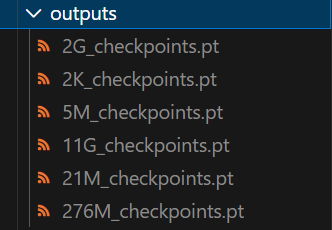
</p>

---

## 3. `class Checkpoint_Manager`

- Objects to store: Model parameters, optimizer parameters, current iteration step.

```Python

[CODE EXPUNGED]

```

---

## 3. `class Checkpoint_Manager`

- Objects to load: Model parameters, optimizer parameters, current iteration step.

```Python

[CODE EXPUNGED]

```

---

## PART6: Start of Training: Input Parameter Decoding

---

## To This Point...

We have sorted out:
- The architecture of each model module and its required parameters.
- The implementation of each training module and its required parameters.

Regarding passing parameters...

How do we determine the specific values of these parameters, then **effectively** modify and pass them to each module?

---

## 1. Starting Training Scripts

- We can directly assign values to various parameters in the training script.
- When the training script is very complex, the various functional modules may become hard to keep track of. 
- We usually use a `bash` script to carry the required parameter values and start the execution of the `python` training script.

<p align="center">
    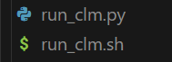
</p>

---

## 1. Starting Training Scripts

<div style="display: flex; gap: 10px">

<div style="flex: 1.6;">

```bash
#!/bin/bash
python /home/kuangph/CS336-Assignment1/cs336_basics/run_clm.py \
    --d_model 512 \
    --num_heads 8 \
    --d_ff 1344 \
    --vocab_size 32000 \
    --num_layers 8\
    --max_seq_length 256 \
    --seq_length 256 \
    --batch_size 48 \
    --theta 100000 \
    --device cuda \
    --num_epochs 5.5 \
    --lr 1e-4 \
    --lr_min 1e-5 \
    --warmup_ratio 0.05 \
    --warmfix_ratio 0.9 \
    --chunk_size 500000 \
    --vocab_path /home/kuangph/CS336-Assignment1/data/vocab_32000.txt \
    --merges_path /home/kuangph/CS336-Assignment1/data/merges_32000.txt \
    --special_tokens "<|endoftext|>" \
    --corpus_size "2G" \
    --log_interval 20 \
    --save_interval 500 \
    --weight_decay 0.01 \
    --betas 0.9 0.95 \
    --eps 1e-8 \
    --max_norm 1.0
```

</div>

<div style="flex: 1;">

* It is equivalent to entering a long command line in the terminal, containing information we need
* For `run_clm.py`, we need to properly parse the command-line arguments.

</div>

</div>

---

## 2. Parameter Decoding

<div style="display: flex; gap: 10px">

<div style="flex: 1;">

```Python
def parse_bash_args():
    parser=argparse.ArgumentParser()
    
    parser.add_argument("--d_model",type=int,default=512)
    parser.add_argument("--num_heads",type=int,default=8)
    parser.add_argument("--d_ff",type=int,default=1344)
    parser.add_argument("--vocab_size",type=int,default=32000)
    parser.add_argument("--num_layers",type=int,default=6)
    parser.add_argument("--max_seq_length",type=int,default=512)
    parser.add_argument("--seq_length",type=int,default=256)
    parser.add_argument("--batch_size",type=int,default=32)
    parser.add_argument("--theta",type=int,default=100000)
    parser.add_argument("--device",type=str,default="cuda")

    parser.add_argument("--num_epochs",type=float,default=10)
    parser.add_argument("--lr",type=float,default=1e-4)
    parser.add_argument("--lr_min",type=float,default=1e-5)
    parser.add_argument("--warmup_ratio",type=float,default=0.1)
    parser.add_argument("--warmfix_ratio",type=float,default=0.9)
    parser.add_argument("--corpus_size",type=str)
```

</div>

<div style="flex: 1;">

```Python
parser.add_argument("--chunk_size",type=int,default=500000)
parser.add_argument("--vocab_path",type=str,
                    default="data/vocab_32000.txt")
parser.add_argument("--merges_path",type=str,
                    default="data/merges_32000.txt")
parser.add_argument("--special_tokens",
                    type=str, nargs="*", default=["<|endoftext|>"])

parser.add_argument("--log_interval",type=int)    
parser.add_argument("--save_interval",type=int)

parser.add_argument("--weight_decay",type=float,default=0.01)
parser.add_argument("--betas",type=float, nargs="*",
                    default=(0.9,0.95))
parser.add_argument("--eps",type=float,default=1e-8)

parser.add_argument("--max_norm",type=float,default=1.0)
    
args=parser.parse_args()
return args
```

</div>

</div>

---

## 2. Parameter Decoding

<div style="display: flex; gap: 10px">

<div style="flex: 1;">

```Python

[CODE EXPUNGED]

```

</div>

<div style="flex: 1;">

```Python

[CODE EXPUNGED]

```

</div>

</div>

---

## PART7: Complete Script

---

## Review of Model Training Process

- Receive parameters, set up the model and training modules.
- Determine the total number of iterative optimization steps.
- For each step:
  - Sample data.
  - Forward.
  - Calculate loss.
  - Calculate gradients and clip.
  - Schedule the learning rate.
  - Update parameters.
- It is recommended to output real-time status during the process, such as the current loss function value, current text prediction results, etc.

---

<p align="center" style="font-size: 1.5em;">
<strong> Code Explanation </strong>
</p>

---

## PART8: Autoregressive Decoding

---

## Determining Input Text

During training, fixed-length text is often sampled as input to the model. However, the total length of decoded text may be unpredictable.

<p align="center">
    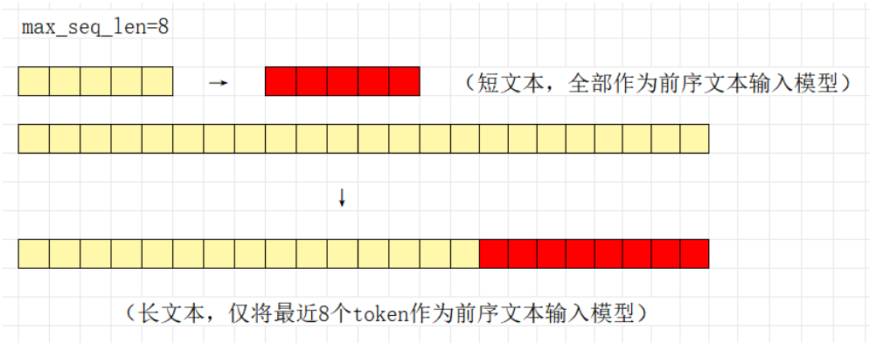
</p>

---

## Sampling Output Values

* During training, we need to know the output at all positions to calculate the loss value; 
* During decoding, we only care about "what is the next word?"!

<p align="center">
    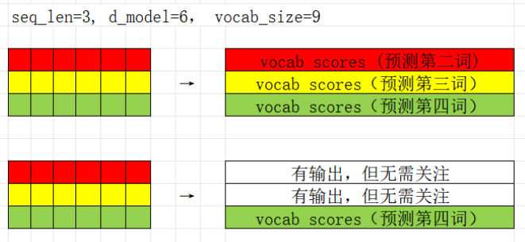
</p>

---

## From Vocab Scores to Token Sampling

After receiving vocab scores:
- Repetition penalty: Reduce scores of recently appeared tokens to avoid repeating the same word.
- Temperature sampling: Scale all scores by the same factor to make softmax differences larger/smaller.
- Softmax: Convert scores into a probability distribution.
- Randomly sample the next token according to the probability distribution.

---

## Autoregressive

The sampled output of this step is part of the input for the next step.

<p align="center">
    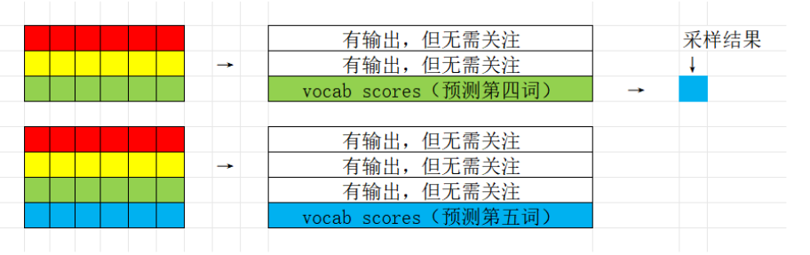
</p>

---

<p align="center" style="font-size: 1.5em;">
<strong>Code Explanation and Practical Demonstration</strong>
</p>
